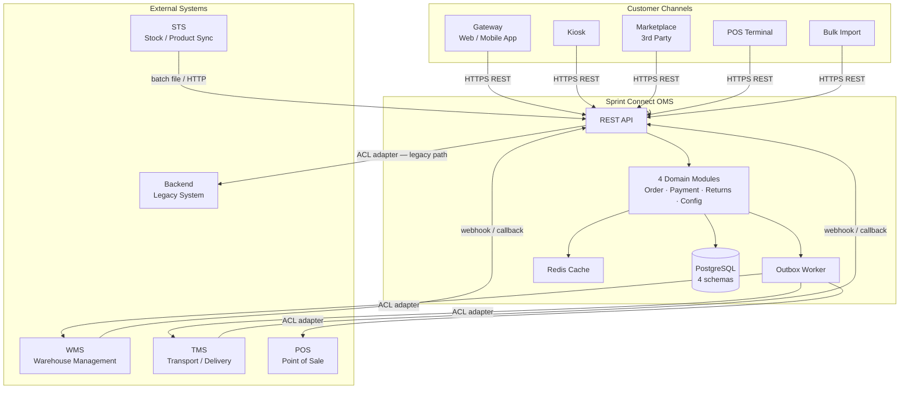
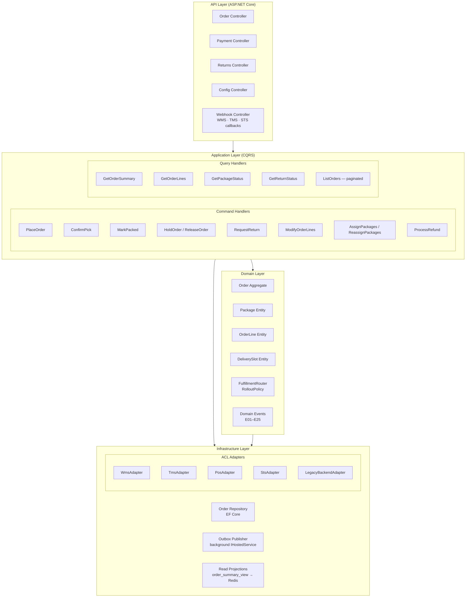
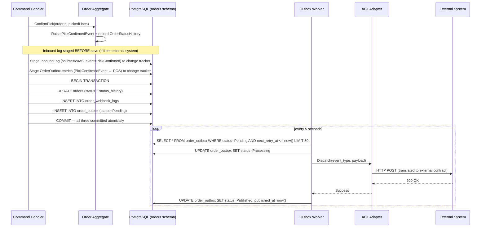

# OMS System Architecture

> Sprint Connect Order Management System — Full Architecture Design
> Scale: ~70,000 order lines/day | Pattern: Modular Monolith + DDD + CQRS + Outbox

---

## 1. Technology Stack

| Layer | Choice | Reason |
|---|---|---|
| Language | C# (.NET 10) | Strong type system for DDD aggregates; native async; production-proven for OMS workloads |
| Web Framework | ASP.NET Core Web API | Minimal API for performance; middleware pipeline for auth/validation |
| Database | PostgreSQL 16 | JSONB for outbox payload; table partitioning; row-level locking on aggregate writes |
| ORM | EF Core 9 (code-first) | Per-schema DbContext per module; owned entities for value objects |
| Cache | Redis 7 | Read projections (order summaries, status lookups); TTL-based invalidation |
| Auth | JWT + OAuth2 (internal) | Per-channel token claims; service-to-service shared secret for WMS/TMS/POS |
| Container | Docker + Docker Compose (dev) / Kubernetes (prod) | Single deployable image; sidecar for outbox worker |
| Logging | Serilog → Elasticsearch | Structured JSON; separate from domain DB |
| Monitoring | OpenTelemetry → Grafana | Traces per order_id; outbox lag metric |
| Config | Environment variables + Vault | No secrets in code; rotation without redeploy |

---

## 2. System Context



---

## 3. Internal Component Architecture



---

## 4. Module Boundaries

Each module has its **own DB schema** and its **own DbContext**. Cross-module access is **only via IDs** — never via direct table joins across schemas.

```
┌─────────────────────────────────────────────────────────────────────┐
│                     Sprint Connect OMS Process                       │
│                                                                     │
│  ┌──────────────────┐  ┌──────────────────┐  ┌─────────────────┐  │
│  │   Order Module    │  │  Payment Module   │  │ Returns Module  │  │
│  │  schema: orders   │  │  schema: payment  │  │ schema: returns │  │
│  │                   │  │                   │  │                 │  │
│  │  Order aggregate  │  │  Invoice          │  │  Return agg     │  │
│  │  Package entity   │  │  CreditNote       │  │  ReturnItem     │  │
│  │  OrderLine entity │  │  Payment          │  │  PutAwayLog     │  │
│  │  DeliverySlot     │  │  OrderFee         │  │  Refund         │  │
│  │  OrderHold        │  │  OrderPromotion   │  │                 │  │
│  │  order_outbox     │  │                   │  │                 │  │
│  │  order_status_    │  │                   │  │                 │  │
│  │    history        │  │                   │  │                 │  │
│  │  order_inbound_   │  │                   │  │                 │  │
│  │    logs           │  │                   │  │                 │  │
│  └──────────────────┘  └──────────────────┘  └─────────────────┘  │
│                                                                     │
│  ┌──────────────────────────────────────────────────────────────┐  │
│  │              Configuration Module (schema: config)            │  │
│  │   StoreLocation · BusinessUnit · RolloutPolicy               │  │
│  │   FulfillmentRoutingRule · NotificationTemplate              │  │
│  └──────────────────────────────────────────────────────────────┘  │
│                                                                     │
│  ┌──────────────────────────────────────────────────────────────┐  │
│  │          Audit DB (separate database — not domain)            │  │
│  │                   Serilog → audit_logs                        │  │
│  └──────────────────────────────────────────────────────────────┘  │
└─────────────────────────────────────────────────────────────────────┘
```

**Cross-module communication rules:**

| From | To | Mechanism |
|---|---|---|
| Payment Module | Order Module | Read `order_id` only; never joins `orders` table directly |
| Returns Module | Order Module | Reads order state via OrderQuery service (in-process call, same process) |
| Returns Module | Payment Module | Triggers refund via `IRefundService` interface — no direct DB access |
| All modules | Config Module | Read-only config lookup via `IConfigurationService` |
| Any module | Any module | Domain events via Outbox only for cross-boundary side-effects |

---

## 5. Integration Architecture

### 5.1 Outbox + ACL Adapter Flow

The OMS never calls external systems synchronously from a command handler. All outbound calls go through the Outbox.



### 5.2 ACL Adapter Responsibilities

Each adapter translates between OMS domain language and external system contracts:

| Adapter | Translates | External call |
|---|---|---|
| **WmsAdapter** | `PickStarted` → WMS Pick Order API; WMS callback → `PickConfirmed` domain command | HTTP REST to WMS API |
| **TmsAdapter** | `OrderPackaged` → TMS Dispatch API (per TrackingId); TMS callback → `PackageOutForDelivery`, `PackageDelivered` | HTTP REST to TMS API |
| **PosAdapter** | `PickConfirmed` → POS Recalculation API; POS response → Invoice trigger | HTTP REST to POS API |
| **StsAdapter** | Receives batch Item Master file from STS; transforms → internal catalog update | SFTP pull + parse |
| **LegacyBackendAdapter** | Non-rolled-out store → Proxy Service → Backend Sale Order API | HTTP REST (legacy contract) |

### 5.3 Inbound Webhook Processing

External systems call back into OMS via the Webhook Controller:

```
POST /webhooks/wms/pick-confirmed      → ConfirmPickCommand       (source=WMS)
POST /webhooks/wms/put-away-confirmed  → ConfirmPutAwayCommand    (source=WMS)
POST /webhooks/tms/package-dispatched  → PackageOutForDeliveryCommand (source=TMS)
POST /webhooks/tms/package-delivered   → PackageDeliveredCommand  (source=TMS)
POST /webhooks/tms/package-lost        → PackageLostCommand       (source=TMS)
POST /webhooks/pos/recalculation-result → ApplyPosRecalculationCommand (source=POS)
```

All webhook endpoints:
1. Log the inbound event (structured `ILogger` with `orderId`, `source`, contextual data)
2. Deserialise payload into an internal command
3. Dispatch to MediatR command handler
4. Return `202 Accepted` immediately — processing is synchronous but lightweight

Each inbound command handler:
1. Stages an `OrderWebhookLog` entry (`source_system`, `event_type`, `detail`, `received_at`) via `IWebhookEventLogger.Stage()`
2. Applies the domain transition (`order.ConfirmPick(...)`, etc.)
3. Stages outbox entries for any resulting domain events (atomically)
4. Calls `orderRepository.SaveAsync()` — commits all three in one transaction

### 5.4 Outbound Event Routing

`OutboxEventTargetMapper` defines which external systems receive each domain event:

| Domain Event | Target Systems |
|---|---|
| `OrderCreatedEvent` | WMS |
| `BookingConfirmedEvent` | WMS |
| `PickStartedEvent` | WMS |
| `PickConfirmedEvent` | POS |
| `OrderPackedEvent` | TMS |
| `PackagesAssignedEvent` / `ReassignedEvent` | TMS |
| `OrderOnHoldEvent` | WMS, TMS |
| `OrderReleasedEvent` | WMS, TMS |
| `OrderCancelledEvent` | WMS, TMS, POS |
| `OrderRescheduledEvent` | TMS |
| `OrderLinesModifiedEvent` | WMS, POS |
| `ReadyForCollectionEvent` | POS |
| `OrderCollectedEvent` / `DeliveredEvent` | POS |
| `InvoiceGeneratedEvent` / `PaymentNotifiedEvent` | POS |
| `ReturnRequestedEvent` | TMS |
| `PutAwayConfirmedEvent` | POS |

---

## 6. CQRS Read / Write Separation

### Write path (commands)

```
HTTP POST /orders/{id}/confirm-pick
  → ConfirmPickCommandHandler
    → Load Order aggregate from orders + order_lines + order_packages
    → Validate state machine transition
    → Apply domain logic
    → Persist changes (EF Core SaveChanges)
    → Insert to order_outbox (same transaction)
```

### Read path (queries)

Queries never touch the write tables directly. They read from:
1. **Redis** — `order_summary:{order_id}` (hot path, TTL 5 minutes)
2. **order_summary_view** (PostgreSQL read-optimised view) — cache miss fallback
3. **Paginated list queries** — hit DB with covering indexes
4. **Timeline query** — `GET /orders/{id}/timeline` merges `order_status_history` + `order_webhook_logs` + `order_outbox` into a single chronological view with three entry types: `Domain`, `Inbound`, `Outbound`

```sql
-- Materialised view for reads (refreshed by trigger or outbox worker)
CREATE MATERIALIZED VIEW order_summary_view AS
SELECT
    o.order_id,
    o.order_number,
    o.status,
    o.fulfillment_type,
    o.payment_method,
    o.channel_type,
    o.store_id,
    o.order_date,
    COUNT(ol.order_line_id)   AS line_count,
    SUM(ol.picked_amount * ol.unit_price) AS total_amount
FROM orders o
LEFT JOIN order_lines ol ON ol.order_id = o.order_id
GROUP BY o.order_id;

CREATE UNIQUE INDEX ON order_summary_view (order_id);
```

Cache invalidation: Outbox Worker calls `IOrderCacheInvalidator.Invalidate(orderId)` after publishing each event.

---

## 7. Deployment Architecture

### 7.1 Container Layout

```
┌─────────────────────────────────────────────────────────────────┐
│                    Kubernetes Namespace: oms                     │
│                                                                 │
│  ┌───────────────────────────────────────────────────────────┐ │
│  │                  Deployment: oms-api                       │ │
│  │  replicas: 2                                               │ │
│  │  ┌──────────────────────────────────────────────────────┐ │ │
│  │  │  Container: oms-api                                    │ │ │
│  │  │  ASP.NET Core Web API                                  │ │ │
│  │  │  port: 8080                                            │ │ │
│  │  │  liveness:  GET /health                                │ │ │
│  │  │  readiness: GET /health/ready                          │ │ │
│  │  └──────────────────────────────────────────────────────┘ │ │
│  └───────────────────────────────────────────────────────────┘ │
│                                                                 │
│  ┌───────────────────────────────────────────────────────────┐ │
│  │              Deployment: oms-outbox-worker                 │ │
│  │  replicas: 1  (single writer — prevents duplicate publish) │ │
│  │  ┌──────────────────────────────────────────────────────┐ │ │
│  │  │  Container: oms-outbox-worker                          │ │ │
│  │  │  .NET IHostedService polling order_outbox              │ │ │
│  │  │  Calls WMS / TMS / POS ACL adapters                    │ │ │
│  │  └──────────────────────────────────────────────────────┘ │ │
│  └───────────────────────────────────────────────────────────┘ │
│                                                                 │
│  ┌─────────────────────┐   ┌─────────────────────────────┐    │
│  │  StatefulSet: redis  │   │  External: PostgreSQL RDS    │    │
│  │  Redis 7             │   │  (managed, multi-AZ)         │    │
│  │  port: 6379          │   │  4 schemas in 1 DB           │    │
│  └─────────────────────┘   └─────────────────────────────┘    │
│                                                                 │
│  ┌─────────────────────────────────────────────────────────┐  │
│  │              Ingress (NGINX / AWS ALB)                    │  │
│  │  /api/*      → oms-api:8080                               │  │
│  │  /webhooks/* → oms-api:8080                               │  │
│  └─────────────────────────────────────────────────────────┘  │
└─────────────────────────────────────────────────────────────────┘
```

### 7.2 Why 1 Replica for Outbox Worker

The Outbox Worker must be a **single instance** to avoid double-publishing. The query uses `SELECT ... FOR UPDATE SKIP LOCKED` so multiple replicas would still be safe, but a single replica keeps it simple at this scale.

```sql
SELECT * FROM order_outbox
WHERE status = 'Pending'
  AND next_retry_at <= NOW()
ORDER BY created_at
LIMIT 50
FOR UPDATE SKIP LOCKED;
```

If the worker crashes, Kubernetes restarts it within ~30 seconds. Events are not lost — they stay in `Pending` state until re-processed.

### 7.3 Scaling Strategy

| Component | Strategy |
|---|---|
| oms-api | Horizontal (2 replicas → 4 under load); stateless — no session state |
| oms-outbox-worker | 1 replica always; single-writer pattern |
| PostgreSQL | Vertical first (scale instance class); read replica for queries if needed |
| Redis | Single node; cluster mode only if cache approaches 10GB |
| order_lines partition | Range partition by `created_at` every 6 months when rows > 15M |

---

## 8. Data Architecture

### 8.1 Schema Organisation

```
PostgreSQL DB: oms_db
├── schema: orders          (Order module write tables)
├── schema: payment         (Payment module)
├── schema: returns         (Returns module)
├── schema: config          (Configuration module)
└── schema: audit           (Logs — append-only, never queried by domain code)

Separate DB: oms_audit_db
└── table: audit_logs       (Serilog structured logs)
```

### 8.2 Key Index Strategy

```sql
-- Primary order lookup paths
CREATE INDEX idx_orders_status ON orders.orders (status);
CREATE INDEX idx_orders_store_status ON orders.orders (store_id, status);
CREATE INDEX idx_orders_order_date ON orders.orders (order_date DESC);
CREATE INDEX idx_order_lines_order_id ON orders.order_lines (order_id);

-- Outbox worker performance
CREATE INDEX idx_outbox_pending ON orders.order_outbox (status, next_retry_at)
    WHERE status IN ('Pending', 'Failed');

-- Package tracking lookup (TMS callbacks come with tracking_id)
CREATE UNIQUE INDEX idx_packages_tracking ON orders.order_packages (tracking_id)
    WHERE tracking_id IS NOT NULL;

-- Returns lookup
CREATE INDEX idx_returns_order_id ON returns.returns (order_id);
CREATE INDEX idx_returns_status ON returns.returns (status);
```

### 8.3 Outbox Retention

```sql
-- Purge job (run nightly via pg_cron or Kubernetes CronJob)
DELETE FROM orders.order_outbox
WHERE status = 'Published'
  AND published_at < NOW() - INTERVAL '7 days';

-- Failed events — alert if retry_count > 5
-- These need manual intervention; don't auto-delete
```

---

## 9. API Design

### 9.1 Route Structure

```
/api/v1/orders
  POST   /                          ← PlaceOrder
  GET    /{orderId}                 ← GetOrder (from cache/read projection)
  GET    /                          ← ListOrders (paginated)
  PATCH  /{orderId}/confirm-booking ← ConfirmBooking
  PATCH  /{orderId}/start-pick      ← StartPick
  PATCH  /{orderId}/confirm-pick    ← ConfirmPick
  PATCH  /{orderId}/pack            ← MarkPacked
  PATCH  /{orderId}/hold            ← HoldOrder
  PATCH  /{orderId}/release         ← ReleaseOrder
  PATCH  /{orderId}/assign-packages ← AssignPackages
  PATCH  /{orderId}/reassign-packages ← ReassignPackages
  PATCH  /{orderId}/modify-lines    ← ModifyOrderLines
  PATCH  /{orderId}/cancel          ← CancelOrder

/api/v1/returns
  POST   /                          ← RequestReturn
  GET    /{returnId}                ← GetReturn
  PATCH  /{returnId}/confirm-refund ← ConfirmRefund

/api/v1/config
  GET    /stores/{storeId}
  GET    /rollout-policy/{storeId}

/webhooks/wms/pick-confirmed
/webhooks/wms/put-away-confirmed
/webhooks/tms/package-dispatched
/webhooks/tms/package-delivered
/webhooks/tms/package-lost
/webhooks/sts/item-master-sync
```

### 9.2 Idempotency

All `POST` and `PATCH` endpoints accept `Idempotency-Key` header. The key is stored in Redis with a 24-hour TTL. If a duplicate request arrives with the same key, the original response is returned without re-processing.

---

## 10. Security Design

| Concern | Implementation |
|---|---|
| Customer channel auth | JWT Bearer token; issued by Gateway/Identity service; validated in OMS middleware |
| Service-to-service | Shared HMAC secret per integration (WMS, TMS, POS); validated on all webhook endpoints |
| Database credentials | Injected via Vault at startup; rotated without redeploy |
| Secrets in config | Never in code or environment variables committed to git; Vault only |
| Input validation | FluentValidation on all command DTOs; max field lengths enforced |
| Order access control | Order belongs to a store; JWT claim `store_id` validated against order's `store_id` on every read |
| Audit trail | Every state transition logged to `audit_logs` with `order_id`, `actor`, `from_status`, `to_status`, `timestamp` |
| Webhook replay attacks | Timestamp in HMAC payload; reject if > 5 minutes old |

---

## 11. Observability

### 11.1 Key Metrics

| Metric | Alert threshold |
|---|---|
| `outbox_pending_count` | > 500 for > 2 minutes → page on-call |
| `outbox_failed_count` | > 0 → Slack alert |
| `order_state_transition_latency_ms` | p99 > 500ms → investigate |
| `api_error_rate_5xx` | > 1% over 5min → alert |
| `db_connection_pool_exhausted` | Any → critical alert |
| `redis_cache_hit_ratio` | < 70% → review TTL or projection refresh |

### 11.2 Distributed Tracing

Every request carries `X-Correlation-ID`. This flows into:
- All log entries (via Serilog enricher)
- All outbox events (`correlation_id` field in payload)
- All ACL adapter calls (forwarded as `X-Correlation-ID` header to external systems)

This allows tracing a single order's full lifecycle across OMS → WMS → TMS → POS.

---

## 12. Scalability Summary

| Risk | Mitigation | When to apply |
|---|---|---|
| Outbox table bloat | Nightly purge of `Published` events older than 7 days | From day 1 |
| order_lines table scan | Partition `order_lines` by `created_at` (6-month ranges) | When rows > 15M (~6 months at 70K/day) |
| N+1 on aggregate load | CQRS: read projections (`order_summary_view`) + Redis cache for all GET endpoints | From day 1 |
| Write contention on hot orders | Optimistic concurrency (`rowversion` / EF Core `ConcurrencyToken`) on `orders` row | From day 1 |
| API replica bottleneck | Add replicas (2→4) behind load balancer; oms-api is stateless | When CPU p95 > 70% |
| Outbox worker throughput | Increase `LIMIT` batch size (50→200); if still insufficient, partition outbox by `status` hash | When lag > 1 minute consistently |

At **70K order lines/day (~50K orders/day)** a single PostgreSQL instance with proper indexing handles this comfortably up to ~500K orders/day. Microservices are not warranted at this scale.

---

## 13. Future Migration Path

When a specific module needs independent scaling (most likely Payment for high-volume invoice reconciliation):

```
Phase 1 (now):         Modular Monolith — 1 process, 4 schemas, shared DB
Phase 2 (if needed):   Extract Payment Module → separate service with its own DB
                        Use Outbox events as integration contract (already in place)
Phase 3 (if needed):   Extract Returns Module → separate service
                        Order Module remains the write authority for order state
```

The Outbox + ACL pattern already in place means module extraction does not require rewriting integration logic — the event contracts are the interface.
