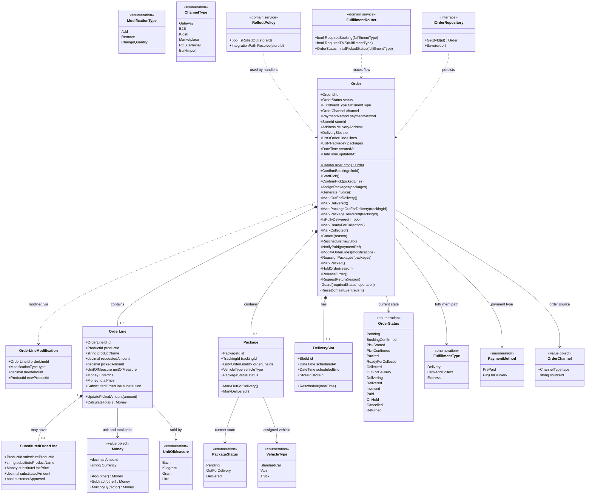
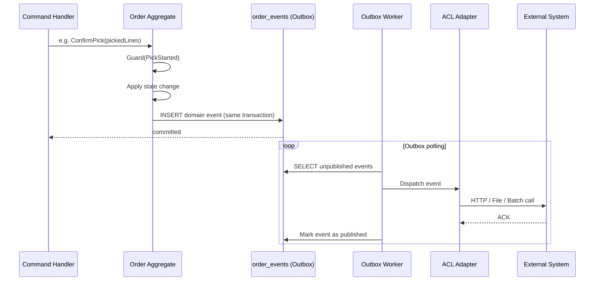
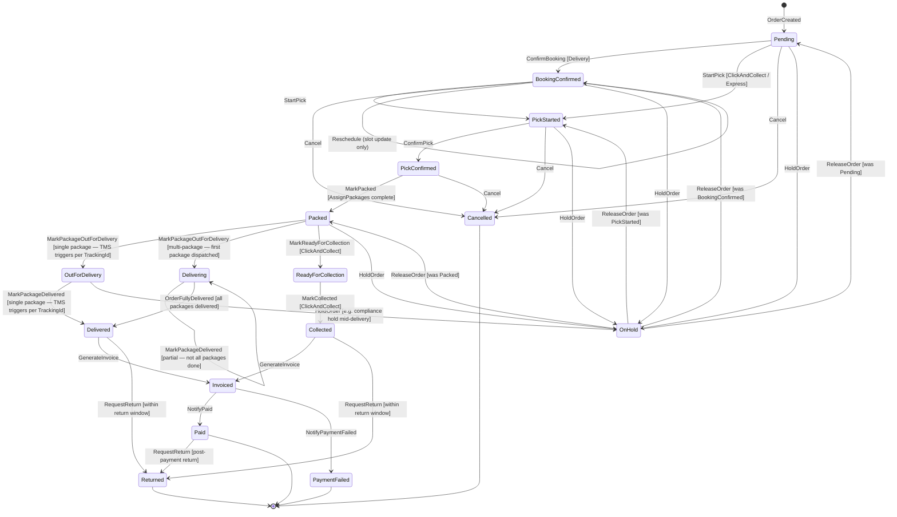
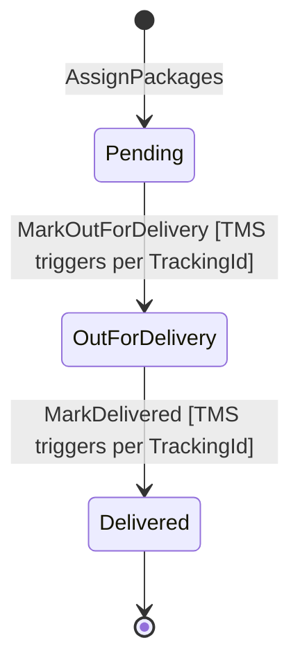
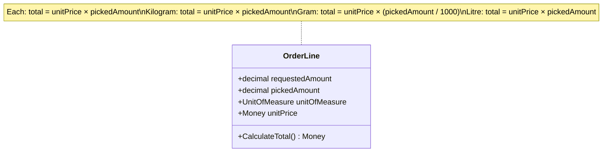

# OMS Domain-Driven Design Diagram

> Sprint Connect owns and runs the OMS. The bounded context below represents Sprint Connect's internal domain model.
> Updated to support multiple fulfillment types (Delivery, Click & Collect, Express), weight-based order lines, and multi-vehicle split delivery (Package entity — TMS reports per TrackingId).

---

## Bounded Context Map

```mermaid
graph TD
    subgraph SC["Sprint Connect Bounded Context (OMS)"]
        ORDER["Order\n(Aggregate Root)"]
        ORDER_LINE["OrderLine\n(Entity)"]
        SUB_LINE["SubstitutedOrderLine\n(Entity)"]
        PACKAGE["Package\n(Entity)"]
        DELIVERY_SLOT["DeliverySlot\n(Entity)"]
        ORDER_STATUS["OrderStatus\n(Value Object)"]
        PACKAGE_STATUS["PackageStatus\n(Value Object)"]
        VEHICLE_TYPE["VehicleType\n(Value Object)"]
        FULFILLMENT_TYPE["FulfillmentType\n(Value Object)"]
        PAYMENT_METHOD["PaymentMethod\n(Value Object)"]
        ORDER_CHANNEL["OrderChannel\n(Value Object)"]
        UOM["UnitOfMeasure\n(Value Object)"]
        MONEY["Money\n(Value Object)"]
        ADDRESS["Address\n(Value Object)"]
        ROLLOUT["RolloutPolicy\n(Domain Service)"]
        FULFILLMENT_ROUTER["FulfillmentRouter\n(Domain Service)"]
    end

    subgraph ACL["Anti-Corruption Layers (inside Sprint Connect)"]
        BATCH_ADAPTER["BatchFileAdapter\n(implements IBatchFilePort)"]
        TMS_ADAPTER["TMSAdapter\n(implements ITMSPort)"]
        POS_ADAPTER["POSAdapter\n(implements IPOSPort)"]
        WMS_ADAPTER["WMSAdapter\n(implements IWMSPort)"]
        GW_ADAPTER["GatewayAdapter\n(implements IGatewayPort)"]
    end

    subgraph EVENTS["Domain Events"]
        E1["OrderCreated"]
        E2["BookingConfirmed"]
        E3["PickStarted"]
        E4["PickConfirmed"]
        E5["InvoiceGenerated"]
        E6["OutForDelivery"]
        E7["Delivered"]
        E8["OrderCancelled"]
        E9["OrderRescheduled"]
        E10["PaymentNotified"]
        E11["CreditNoteIssued"]
        E12["ReadyForCollection"]
        E13["OrderCollected"]
        E14["PackagesAssigned"]
        E15["PackageOutForDelivery"]
        E16["PackageDelivered"]
        E17["OrderFullyDelivered"]
        E18["OrderLinesModified"]
        E19["PackagesReassigned"]
        E20["OrderPacked"]
        E21["OrderOnHold"]
        E22["OrderReleased"]
        E23["ReturnRequested"]
        E24["RefundProcessed"]
        E25["PackageLost"]
    end

    subgraph EXTERNAL["External Systems"]
        GW["Gateway"]
        WMS["WMS"]
        TMS["TMS"]
        POS["POS"]
        STS["STS"]
        BE["Backend"]
        FG["File Gateway"]
    end

    ORDER --> ORDER_LINE
    ORDER --> PACKAGE
    ORDER --> DELIVERY_SLOT
    ORDER --> ORDER_STATUS
    ORDER --> FULFILLMENT_TYPE
    ORDER --> ORDER_CHANNEL
    ORDER --> PAYMENT_METHOD
    ORDER_LINE --> MONEY
    ORDER_LINE --> UOM
    ORDER_LINE --> SUB_LINE
    PACKAGE --> PACKAGE_STATUS
    PACKAGE --> VEHICLE_TYPE
    ROLLOUT --> ORDER
    FULFILLMENT_ROUTER --> ORDER

    ORDER --> E1
    ORDER --> E2
    ORDER --> E3
    ORDER --> E4
    ORDER --> E5
    ORDER --> E6
    ORDER --> E7
    ORDER --> E8
    ORDER --> E9
    ORDER --> E10
    ORDER --> E11
    ORDER --> E12
    ORDER --> E13
    ORDER --> E18
    ORDER --> E19
    ORDER --> E20
    ORDER --> E21
    ORDER --> E22
    ORDER --> E23
    ORDER --> E24
    ORDER --> E25

    GW_ADAPTER -->|inbound: order requests| ORDER
    WMS_ADAPTER -->|inbound: Pick Confirmed, POS Recalculation, Invoice, AssignPackages| ORDER
    TMS_ADAPTER -->|inbound: PackageOutForDelivery, PackageDelivered, POS Recalculation| ORDER

    E3 --> WMS_ADAPTER
    E8 --> TMS_ADAPTER
    E9 --> TMS_ADAPTER
    E5 --> TMS_ADAPTER
    E11 --> TMS_ADAPTER
    E14 --> TMS_ADAPTER
    E15 --> GW_ADAPTER
    E17 --> WMS_ADAPTER
    E12 --> GW_ADAPTER

    GW_ADAPTER <--> GW
    WMS_ADAPTER <--> WMS
    TMS_ADAPTER <--> TMS
    POS_ADAPTER <--> POS
    BATCH_ADAPTER <--> FG
    BATCH_ADAPTER <--> STS
```

---

## Order Aggregate Detail

---

## Domain Events Flow (Outbox Pattern)

---

## Aggregate State Machine

Branching by `FulfillmentType` and package count. Guards shown in `[brackets]`.

---

## Package State Machine (per Package entity)

---

## Weight-Based OrderLine Calculation

