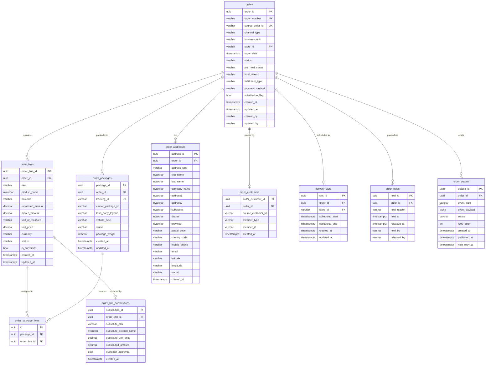
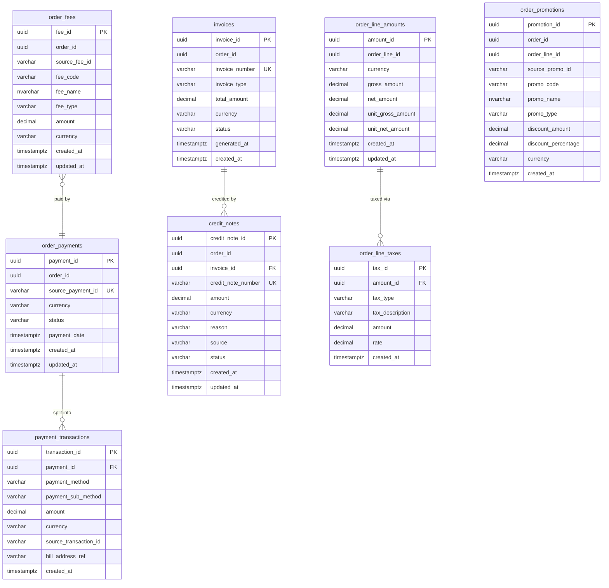
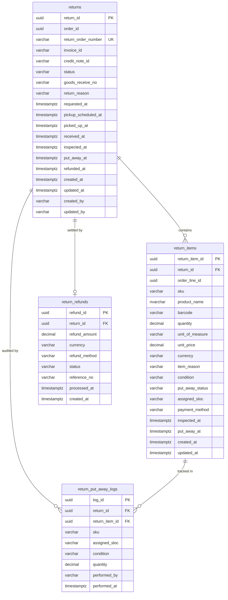
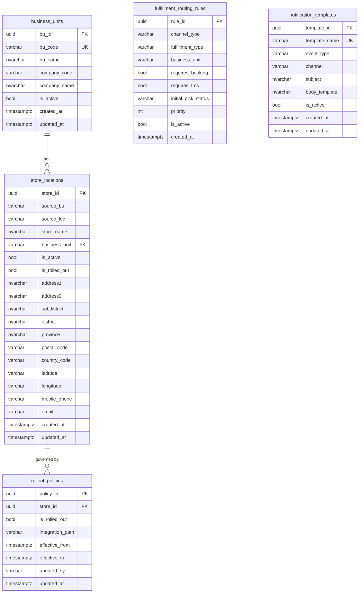

# OMS Service Recommendation & ER Diagrams

> Based on analysis of `order-schema-old.sql` and the new OMS domain model (D018/D019).

---

## Service Recommendation

### Should the OMS have multiple services?

**Recommendation: Modular Monolith — 4 bounded modules, 1 deployment, separate schemas.**

Do NOT split into microservices yet. The reasons:

| Factor | Assessment |
|---|---|
| Team size | Likely small — microservices add overhead that hurts small teams |
| Transaction boundary | Order lifecycle, payment, and returns share the same Order aggregate — splitting requires distributed transactions (Saga overhead) |
| Current state | Old system is a single-DB monolith with no clear module boundaries — extract modules before extracting services |
| Order lifecycle | All state transitions need to be atomic — splitting Order and Payment into separate services means 2PC or Saga for every status update |

**The right path:** Clean internal module boundaries now → extract to independent services later if a specific module needs independent scaling.

---

### The 4 Modules

```
┌──────────────────────────────────────────────────────────────┐
│                    Sprint Connect OMS                         │
│                                                              │
│  ┌─────────────┐  ┌─────────────┐  ┌───────────────────┐  │
│  │   Order     │  │   Payment   │  │     Returns       │  │
│  │   Module    │  │   Module    │  │     Module        │  │
│  │  (schema:   │  │  (schema:   │  │   (schema:        │  │
│  │   orders)   │  │   payment)  │  │    returns)       │  │
│  └─────────────┘  └─────────────┘  └───────────────────┘  │
│                                                              │
│  ┌─────────────────────────────────────────────────────┐   │
│  │            Configuration Module (schema: config)     │   │
│  └─────────────────────────────────────────────────────┘   │
│                                                              │
│  ┌─────────────────────────────────────────────────────┐   │
│  │        Audit / Logging  (separate DB — not domain)   │   │
│  └─────────────────────────────────────────────────────┘   │
└──────────────────────────────────────────────────────────────┘
```

| Module | Owns | Old schema tables it replaces |
|---|---|---|
| **Order** | Order lifecycle, OrderLine, Package, DeliverySlot, Outbox | Order, SubOrder, OrderItem, OrderItemFulFillment, PackageTb, PackageInfo, OrderAddress, OrderCustomer, OrderOutboxTb, OrderSagaTb |
| **Payment** | Invoice, PaymentTransaction, CreditNote, Fees, Promotions | OrderPayment, OrderPaymentTransaction, OrderItemPayment, OrderItemAmout, OrderFeeModel, OrderPromotion |
| **Returns** | Return, ReturnItem, Refund | OrderReturn, OrderReturnItem |
| **Configuration** | StoreLocation, BusinessUnit, RolloutPolicy | BuTbl, StoreLocation, AllowedStatusSetting, OrderProcessConditionTb |

---

## Improvements Over Old Schema

| Old Problem | New Design Fix |
|---|---|
| `Order` + `SubOrder` duplication | Single `orders` table — `SubOrder` concept removed; FulfillmentType drives routing |
| `varchar(4)` status codes | Readable `status` enum strings |
| `INT IDENTITY` PKs | `UUID` PKs — distributed-safe, no coupling |
| FK via `SourceOrderId` strings | Proper UUID FK constraints |
| `PackageTb` per SKU per box | `order_packages` per package entity with `order_package_lines` join |
| State machine in `AllowedStatusSetting` config | State machine enforced in Order aggregate code |
| Logging in domain DB | Separate `audit` database |
| `OrderItemFulFillment` per item | `fulfillment_type` and `delivery_slot` at Order level |
| `OrderSagaTb` flat table | Replaced by Outbox pattern (already in D018/D019) |

---

## ER Diagram — Order Module (schema: orders)



---

## ER Diagram — Payment Module (schema: payment)



---

## ER Diagram — Returns Module (schema: returns)



---

## ER Diagram — Configuration Module (schema: config)



---

## Summary: Old vs New

| Concern | Old Schema | New Design |
|---|---|---|
| Order identity | `INT IDENTITY` + `SourceOrderId varchar` | `UUID` PK — no dual identity needed |
| Sub-orders | `Order` + `SubOrder` (duplicated) | Single `orders` table — FulfillmentType handles routing |
| Package | Per-SKU rows in `PackageTb` | `order_packages` entity + `order_package_lines` join |
| Status | `varchar(4)` codes | Readable enum values |
| State machine | `AllowedStatusSetting` config table | Enforced in Order aggregate code |
| Hold/Resume | Not modelled | `order_holds` table + `pre_hold_status` on `orders` |
| Logging | Mixed in domain DB | Separate `audit` DB |
| Fulfillment routing | `OrderProcessConditionTb` + `OrderItemFulFillment` | `fulfillment_routing_rules` config + `FulfillmentRouter` domain service |
| Returns | `OrderReturn` + `OrderReturnItem` (flat) | `returns` module with status + `return_refunds` |
| Outbox | `OrderOutboxTb` (exists, good) | Improved: adds `retry_count`, `next_retry_at`, `jsonb` payload |
