# OMS Sequence Diagrams

> Sprint Connect owns and runs the OMS. They are represented as a single participant in all diagrams.

---

## UC1 — Pre-paid Delivery Order

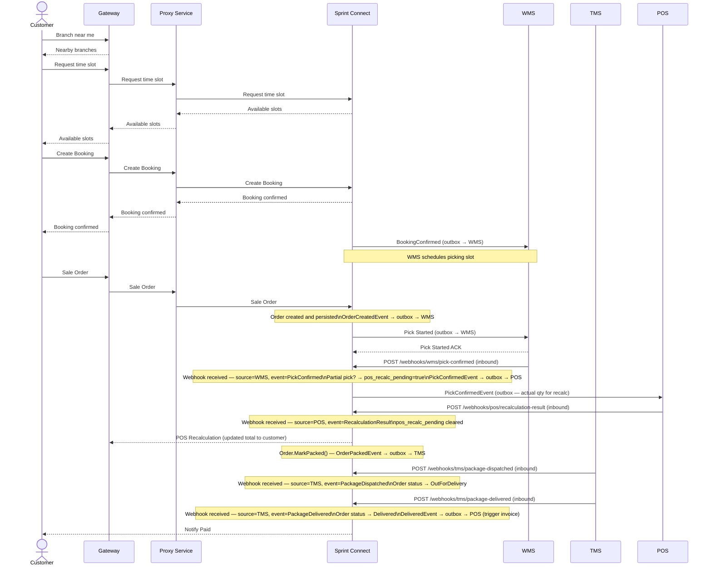
```mermaid
sequenceDiagram
    actor C as Customer
    participant GW as Gateway
    participant PS as Proxy Service
    participant SC as Sprint Connect
    participant WMS as WMS
    participant TMS as TMS
    participant POS as POS

    C->>GW: Branch near me
    GW-->>C: Nearby branches

    C->>GW: Request time slot
    GW->>PS: Request time slot
    PS->>SC: Request time slot
    SC-->>PS: Available slots
    PS-->>GW: Available slots
    GW-->>C: Available slots

    C->>GW: Create Booking
    GW->>PS: Create Booking
    PS->>SC: Create Booking
    SC-->>PS: Booking confirmed
    PS-->>GW: Booking confirmed
    GW-->>C: Booking confirmed
    SC->>WMS: BookingConfirmed (outbox → WMS)
    Note over SC,WMS: WMS schedules picking slot

    C->>GW: Sale Order
    GW->>PS: Sale Order
    PS->>SC: Sale Order
    Note over SC: Order created and persisted\nOrderCreatedEvent → outbox → WMS

    SC->>WMS: Pick Started (outbox → WMS)
    WMS-->>SC: Pick Started ACK

    WMS->>SC: POST /webhooks/wms/pick-confirmed (inbound)
    Note over SC: Webhook received — source=WMS, event=PickConfirmed\nPartial pick? → pos_recalc_pending=true\nPickConfirmedEvent → outbox → POS
    SC->>POS: PickConfirmedEvent (outbox — actual qty for recalc)
    POS->>SC: POST /webhooks/pos/recalculation-result (inbound)
    Note over SC: Webhook received — source=POS, event=RecalculationResult\npos_recalc_pending cleared
    SC-->>GW: POS Recalculation (updated total to customer)

    Note over SC: Order.MarkPacked() — OrderPackedEvent → outbox → TMS

    TMS->>SC: POST /webhooks/tms/package-dispatched (inbound)
    Note over SC: Webhook received — source=TMS, event=PackageDispatched\nOrder status → OutForDelivery

    TMS->>SC: POST /webhooks/tms/package-delivered (inbound)
    Note over SC: Webhook received — source=TMS, event=PackageDelivered\nOrder status → Delivered\nDeliveredEvent → outbox → POS (trigger invoice)
    SC-->>C: Notify Paid
```

---

## UC2 — Pay-on-Delivery (POD) Order

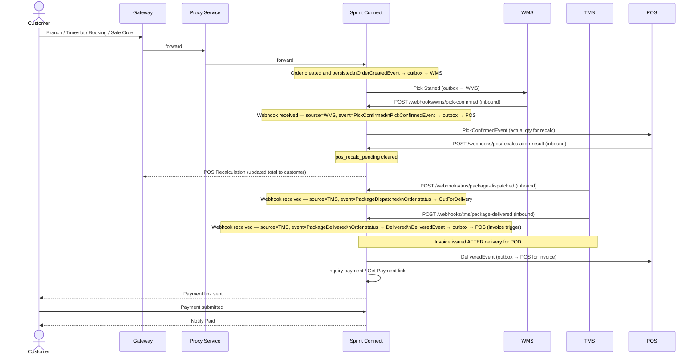
```mermaid
sequenceDiagram
    actor C as Customer
    participant GW as Gateway
    participant PS as Proxy Service
    participant SC as Sprint Connect
    participant WMS as WMS
    participant TMS as TMS
    participant POS as POS

    C->>GW: Branch / Timeslot / Booking / Sale Order
    GW->>PS: forward
    PS->>SC: forward
    Note over SC: Order created and persisted\nOrderCreatedEvent → outbox → WMS

    SC->>WMS: Pick Started (outbox → WMS)
    WMS->>SC: POST /webhooks/wms/pick-confirmed (inbound)
    Note over SC: Webhook received — source=WMS, event=PickConfirmed\nPickConfirmedEvent → outbox → POS
    SC->>POS: PickConfirmedEvent (actual qty for recalc)
    POS->>SC: POST /webhooks/pos/recalculation-result (inbound)
    Note over SC: pos_recalc_pending cleared
    SC-->>GW: POS Recalculation (updated total to customer)

    TMS->>SC: POST /webhooks/tms/package-dispatched (inbound)
    Note over SC: Webhook received — source=TMS, event=PackageDispatched\nOrder status → OutForDelivery

    TMS->>SC: POST /webhooks/tms/package-delivered (inbound)
    Note over SC: Webhook received — source=TMS, event=PackageDelivered\nOrder status → Delivered\nDeliveredEvent → outbox → POS (invoice trigger)

    Note over SC,TMS: Invoice issued AFTER delivery for POD
    SC->>POS: DeliveredEvent (outbox → POS for invoice)

    SC->>SC: Inquiry payment / Get Payment link
    SC-->>C: Payment link sent

    C->>SC: Payment submitted
    SC-->>C: Notify Paid
```

---

## UC3 — Order Cancellation

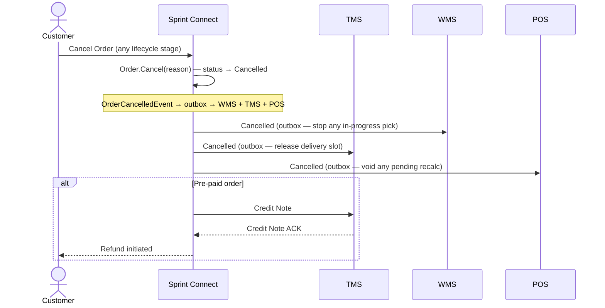
```mermaid
sequenceDiagram
    actor C as Customer
    participant SC as Sprint Connect
    participant TMS as TMS

    C->>SC: Cancel Order (any lifecycle stage)
    SC->>SC: Order.Cancel(reason) — status → Cancelled
    Note over SC: OrderCancelledEvent → outbox → WMS + TMS + POS

    SC->>WMS: Cancelled (outbox — stop any in-progress pick)
    SC->>TMS: Cancelled (outbox — release delivery slot)
    SC->>POS: Cancelled (outbox — void any pending recalc)

    alt Pre-paid order
        SC->>TMS: Credit Note
        TMS-->>SC: Credit Note ACK
        SC-->>C: Refund initiated
    end
```

---

## UC4 — Delivery Reschedule

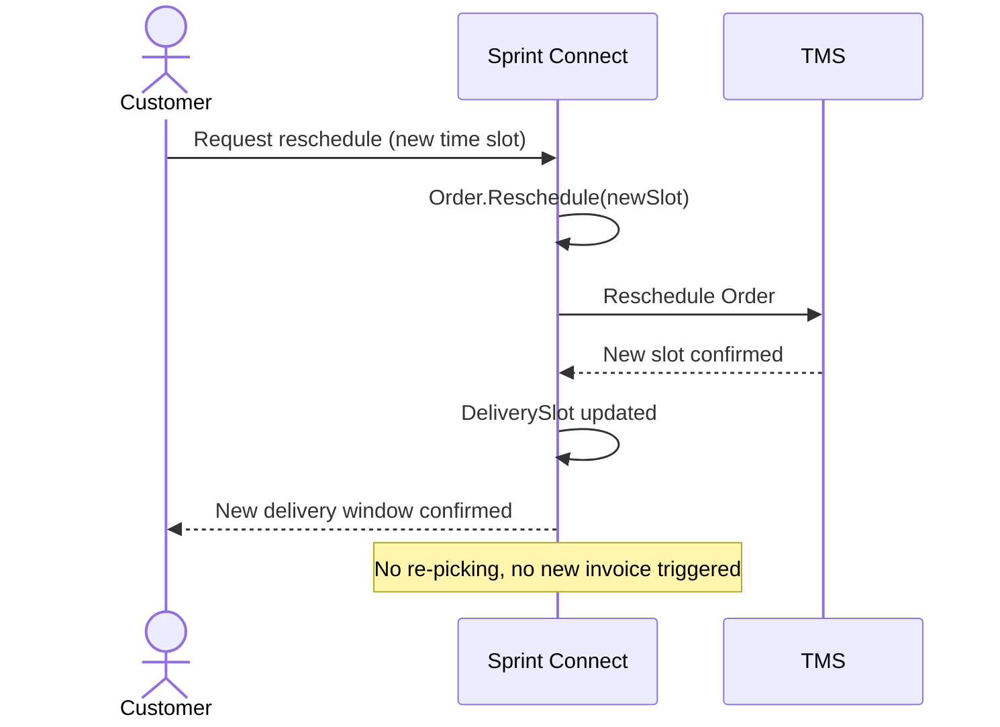
```mermaid
sequenceDiagram
    actor C as Customer
    participant SC as Sprint Connect
    participant TMS as TMS

    C->>SC: Request reschedule (new time slot)
    SC->>SC: Order.Reschedule(newSlot)

    SC->>TMS: Reschedule Order
    TMS-->>SC: New slot confirmed

    SC->>SC: DeliverySlot updated
    SC-->>C: New delivery window confirmed

    Note over SC: No re-picking, no new invoice triggered
```

---

## UC5 — Partial Pick & Credit Note

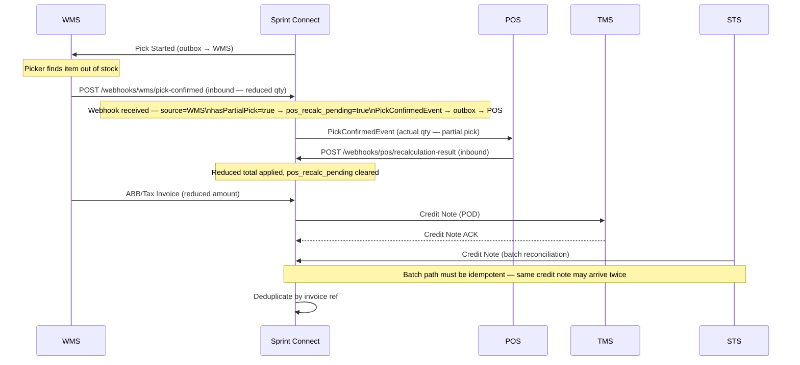
```mermaid
sequenceDiagram
    participant WMS as WMS
    participant SC as Sprint Connect
    participant POS as POS
    participant TMS as TMS
    participant STS as STS

    SC->>WMS: Pick Started (outbox → WMS)
    Note over WMS: Picker finds item out of stock
    WMS->>SC: POST /webhooks/wms/pick-confirmed (inbound — reduced qty)
    Note over SC: Webhook received — source=WMS\nhasPartialPick=true → pos_recalc_pending=true\nPickConfirmedEvent → outbox → POS

    SC->>POS: PickConfirmedEvent (actual qty — partial pick)
    POS->>SC: POST /webhooks/pos/recalculation-result (inbound)
    Note over SC: Reduced total applied, pos_recalc_pending cleared

    WMS->>SC: ABB/Tax Invoice (reduced amount)

    SC->>TMS: Credit Note (POD)
    TMS-->>SC: Credit Note ACK

    STS->>SC: Credit Note (batch reconciliation)
    Note over SC,STS: Batch path must be idempotent — same credit note may arrive twice
    SC->>SC: Deduplicate by invoice ref
```

---

## UC6 — Non-Rolled-Out Store (Legacy Path)

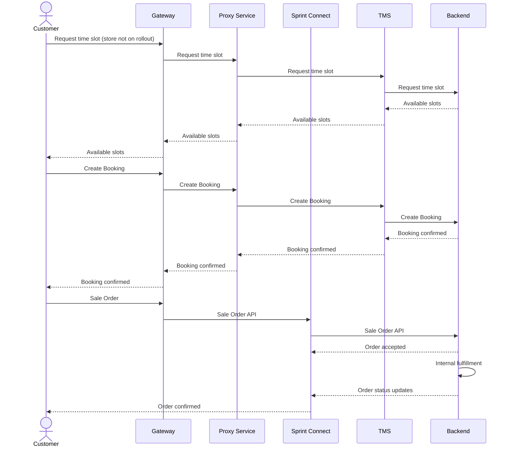
```mermaid
sequenceDiagram
    actor C as Customer
    participant GW as Gateway
    participant PS as Proxy Service
    participant SC as Sprint Connect
    participant TMS as TMS
    participant BE as Backend

    C->>GW: Request time slot (store not on rollout)
    GW->>PS: Request time slot
    PS->>TMS: Request time slot
    TMS->>BE: Request time slot
    BE-->>TMS: Available slots
    TMS-->>PS: Available slots
    PS-->>GW: Available slots
    GW-->>C: Available slots

    C->>GW: Create Booking
    GW->>PS: Create Booking
    PS->>TMS: Create Booking
    TMS->>BE: Create Booking
    BE-->>TMS: Booking confirmed
    TMS-->>PS: Booking confirmed
    PS-->>GW: Booking confirmed
    GW-->>C: Booking confirmed

    C->>GW: Sale Order
    GW->>SC: Sale Order API
    SC->>BE: Sale Order API
    BE-->>SC: Order accepted

    BE->>BE: Internal fulfillment
    BE-->>SC: Order status updates
    SC-->>C: Order confirmed
```

---

## UC7 — Item Master & Product Picture Sync

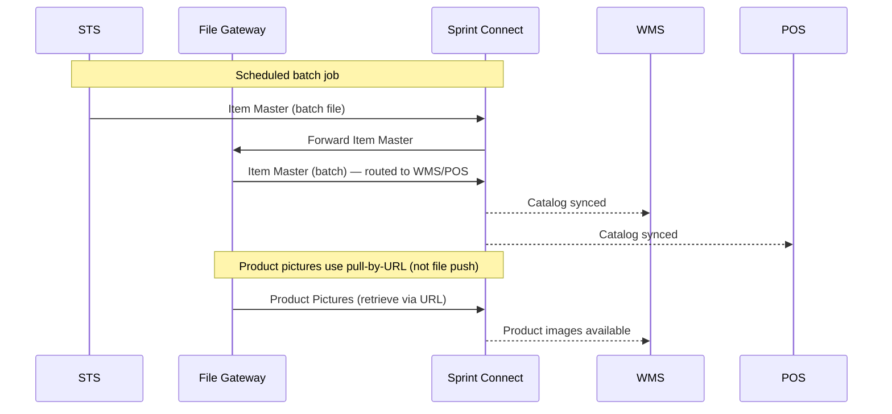
```mermaid
sequenceDiagram
    participant STS as STS
    participant FG as File Gateway
    participant SC as Sprint Connect
    participant WMS as WMS
    participant POS as POS

    Note over STS,SC: Scheduled batch job

    STS->>SC: Item Master (batch file)
    SC->>FG: Forward Item Master
    FG->>SC: Item Master (batch) — routed to WMS/POS
    SC-->>WMS: Catalog synced
    SC-->>POS: Catalog synced

    Note over FG,SC: Product pictures use pull-by-URL (not file push)
    FG->>SC: Product Pictures (retrieve via URL)
    SC-->>WMS: Product images available
```

---

## UC8 — Click & Collect Order

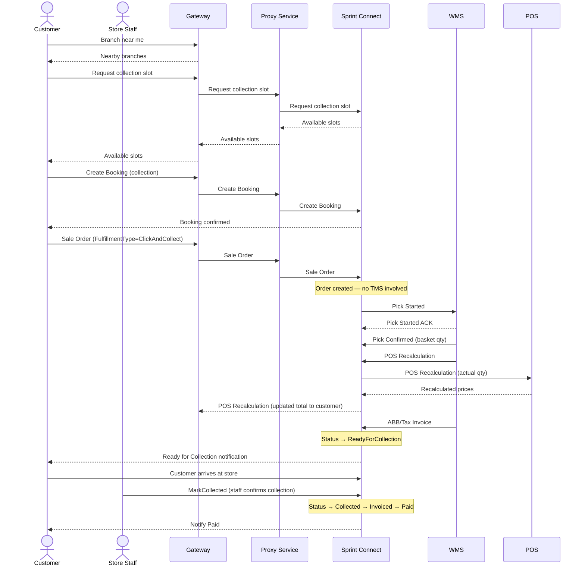
```mermaid
sequenceDiagram
    actor C as Customer
    actor SS as Store Staff
    participant GW as Gateway
    participant PS as Proxy Service
    participant SC as Sprint Connect
    participant WMS as WMS
    participant POS as POS

    C->>GW: Branch near me
    GW-->>C: Nearby branches

    C->>GW: Request collection slot
    GW->>PS: Request collection slot
    PS->>SC: Request collection slot
    SC-->>PS: Available slots
    PS-->>GW: Available slots
    GW-->>C: Available slots

    C->>GW: Create Booking (collection)
    GW->>PS: Create Booking
    PS->>SC: Create Booking
    SC-->>C: Booking confirmed

    C->>GW: Sale Order (FulfillmentType=ClickAndCollect)
    GW->>PS: Sale Order
    PS->>SC: Sale Order
    Note over SC: Order created — no TMS involved

    SC->>WMS: Pick Started
    WMS-->>SC: Pick Started ACK

    WMS->>SC: Pick Confirmed (basket qty)
    WMS->>SC: POS Recalculation
    SC->>POS: POS Recalculation (actual qty)
    POS-->>SC: Recalculated prices
    SC-->>GW: POS Recalculation (updated total to customer)

    WMS->>SC: ABB/Tax Invoice
    Note over SC: Status → ReadyForCollection
    SC-->>C: Ready for Collection notification

    C->>SC: Customer arrives at store
    SS->>SC: MarkCollected (staff confirms collection)
    Note over SC: Status → Collected → Invoiced → Paid
    SC-->>C: Notify Paid
```

---

## UC9 — Express Delivery Order

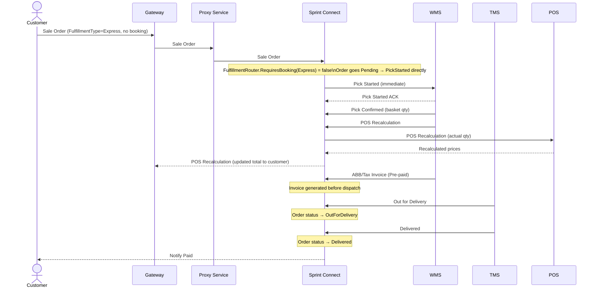
```mermaid
sequenceDiagram
    actor C as Customer
    participant GW as Gateway
    participant PS as Proxy Service
    participant SC as Sprint Connect
    participant WMS as WMS
    participant TMS as TMS
    participant POS as POS

    C->>GW: Sale Order (FulfillmentType=Express, no booking)
    GW->>PS: Sale Order
    PS->>SC: Sale Order
    Note over SC: FulfillmentRouter.RequiresBooking(Express) = false\nOrder goes Pending → PickStarted directly

    SC->>WMS: Pick Started (immediate)
    WMS-->>SC: Pick Started ACK

    WMS->>SC: Pick Confirmed (basket qty)
    WMS->>SC: POS Recalculation
    SC->>POS: POS Recalculation (actual qty)
    POS-->>SC: Recalculated prices
    SC-->>GW: POS Recalculation (updated total to customer)

    WMS->>SC: ABB/Tax Invoice (Pre-paid)
    Note over SC: Invoice generated before dispatch

    TMS->>SC: Out for Delivery
    Note over SC: Order status → OutForDelivery

    TMS->>SC: Delivered
    Note over SC: Order status → Delivered
    SC-->>C: Notify Paid
```

---

## UC10 — Weight-Based Item Order

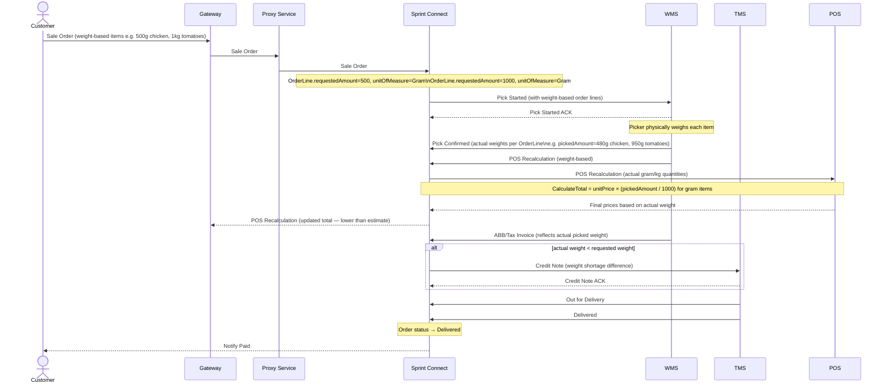
```mermaid
sequenceDiagram
    actor C as Customer
    participant GW as Gateway
    participant PS as Proxy Service
    participant SC as Sprint Connect
    participant WMS as WMS
    participant TMS as TMS
    participant POS as POS

    C->>GW: Sale Order (weight-based items e.g. 500g chicken, 1kg tomatoes)
    GW->>PS: Sale Order
    PS->>SC: Sale Order
    Note over SC: OrderLine.requestedAmount=500, unitOfMeasure=Gram\nOrderLine.requestedAmount=1000, unitOfMeasure=Gram

    SC->>WMS: Pick Started (with weight-based order lines)
    WMS-->>SC: Pick Started ACK

    Note over WMS: Picker physically weighs each item
    WMS->>SC: Pick Confirmed (actual weights per OrderLine\ne.g. pickedAmount=480g chicken, 950g tomatoes)
    WMS->>SC: POS Recalculation (weight-based)
    SC->>POS: POS Recalculation (actual gram/kg quantities)
    Note over SC,POS: CalculateTotal = unitPrice × (pickedAmount / 1000) for gram items
    POS-->>SC: Final prices based on actual weight
    SC-->>GW: POS Recalculation (updated total — lower than estimate)

    WMS->>SC: ABB/Tax Invoice (reflects actual picked weight)

    alt actual weight < requested weight
        SC->>TMS: Credit Note (weight shortage difference)
        TMS-->>SC: Credit Note ACK
    end

    TMS->>SC: Out for Delivery
    TMS->>SC: Delivered
    Note over SC: Order status → Delivered
    SC-->>C: Notify Paid
```

---

## UC11 — Multi-Vehicle Split Delivery (Large Items)

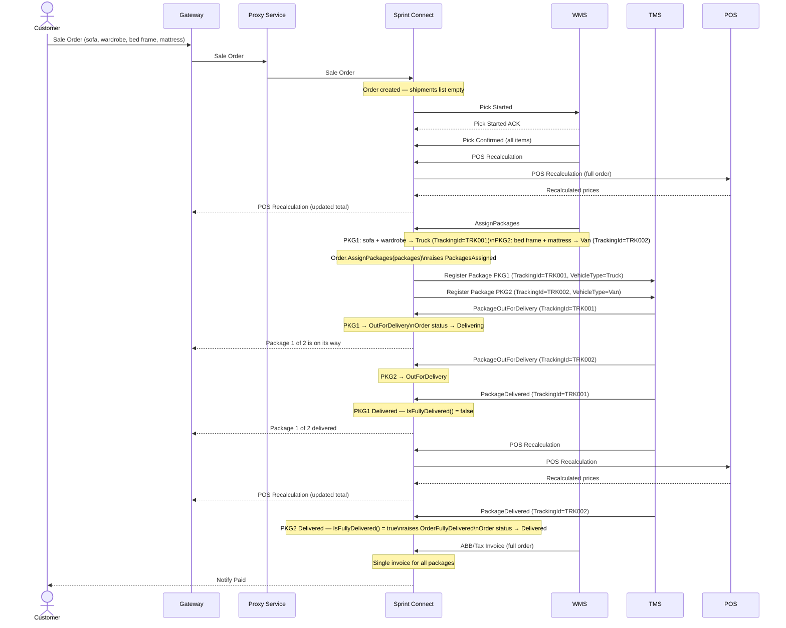
```mermaid
sequenceDiagram
    actor C as Customer
    participant GW as Gateway
    participant PS as Proxy Service
    participant SC as Sprint Connect
    participant WMS as WMS
    participant TMS as TMS
    participant POS as POS

    C->>GW: Sale Order (sofa, wardrobe, bed frame, mattress)
    GW->>PS: Sale Order
    PS->>SC: Sale Order
    Note over SC: Order created — shipments list empty

    SC->>WMS: Pick Started
    WMS-->>SC: Pick Started ACK

    WMS->>SC: Pick Confirmed (all items)
    WMS->>SC: POS Recalculation
    SC->>POS: POS Recalculation (full order)
    POS-->>SC: Recalculated prices
    SC-->>GW: POS Recalculation (updated total)

    WMS->>SC: AssignPackages
    Note over SC,WMS: PKG1: sofa + wardrobe → Truck (TrackingId=TRK001)\nPKG2: bed frame + mattress → Van (TrackingId=TRK002)
    Note over SC: Order.AssignPackages(packages)\nraises PackagesAssigned

    SC->>TMS: Register Package PKG1 (TrackingId=TRK001, VehicleType=Truck)
    SC->>TMS: Register Package PKG2 (TrackingId=TRK002, VehicleType=Van)

    TMS->>SC: PackageOutForDelivery (TrackingId=TRK001)
    Note over SC: PKG1 → OutForDelivery\nOrder status → Delivering
    SC-->>GW: Package 1 of 2 is on its way

    TMS->>SC: PackageOutForDelivery (TrackingId=TRK002)
    Note over SC: PKG2 → OutForDelivery

    TMS->>SC: PackageDelivered (TrackingId=TRK001)
    Note over SC: PKG1 Delivered — IsFullyDelivered() = false
    SC-->>GW: Package 1 of 2 delivered

    TMS->>SC: POS Recalculation
    SC->>POS: POS Recalculation
    POS-->>SC: Recalculated prices
    SC-->>GW: POS Recalculation (updated total)

    TMS->>SC: PackageDelivered (TrackingId=TRK002)
    Note over SC: PKG2 Delivered — IsFullyDelivered() = true\nraises OrderFullyDelivered\nOrder status → Delivered

    WMS->>SC: ABB/Tax Invoice (full order)
    Note over SC: Single invoice for all packages
    SC-->>C: Notify Paid
```

---

## UC12 — Modify Order Lines After Placement

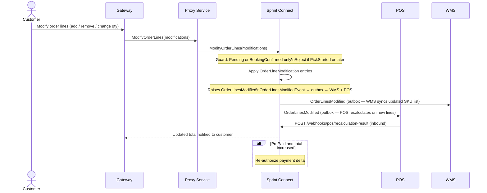
```mermaid
sequenceDiagram
    actor C as Customer
    participant GW as Gateway
    participant PS as Proxy Service
    participant SC as Sprint Connect
    participant POS as POS

    C->>GW: Modify order lines (add / remove / change qty)
    GW->>PS: ModifyOrderLines(modifications)
    PS->>SC: ModifyOrderLines(modifications)
    Note over SC: Guard: Pending or BookingConfirmed only\nReject if PickStarted or later

    SC->>SC: Apply OrderLineModification entries
    Note over SC: Raises OrderLinesModified\nOrderLinesModifiedEvent → outbox → WMS + POS

    SC->>WMS: OrderLinesModified (outbox — WMS syncs updated SKU list)
    SC->>POS: OrderLinesModified (outbox — POS recalculates on new lines)
    POS->>SC: POST /webhooks/pos/recalculation-result (inbound)
    SC-->>GW: Updated total notified to customer

    alt PrePaid and total increased
        Note over SC: Re-authorize payment delta
    end
```

---

## UC14 — Return & Refund

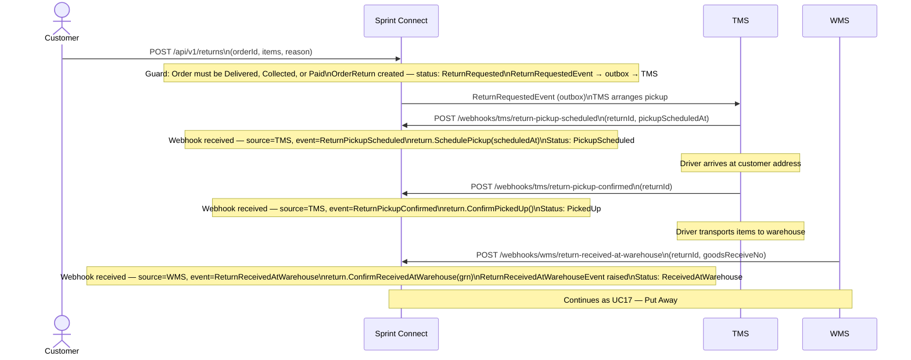
```mermaid
sequenceDiagram
    actor C as Customer
    participant SC as Sprint Connect
    participant TMS as TMS
    participant WMS as WMS

    C->>SC: POST /api/v1/returns\n(orderId, items, reason)
    Note over SC: Guard: Order must be Delivered, Collected, or Paid\nOrderReturn created — status: ReturnRequested\nReturnRequestedEvent → outbox → TMS

    SC->>TMS: ReturnRequestedEvent (outbox)\nTMS arranges pickup

    TMS->>SC: POST /webhooks/tms/return-pickup-scheduled\n(returnId, pickupScheduledAt)
    Note over SC: Webhook received — source=TMS, event=ReturnPickupScheduled\nreturn.SchedulePickup(scheduledAt)\nStatus: PickupScheduled

    Note over TMS: Driver arrives at customer address
    TMS->>SC: POST /webhooks/tms/return-pickup-confirmed\n(returnId)
    Note over SC: Webhook received — source=TMS, event=ReturnPickupConfirmed\nreturn.ConfirmPickedUp()\nStatus: PickedUp

    Note over TMS: Driver transports items to warehouse

    WMS->>SC: POST /webhooks/wms/return-received-at-warehouse\n(returnId, goodsReceiveNo)
    Note over SC: Webhook received — source=WMS, event=ReturnReceivedAtWarehouse\nreturn.ConfirmReceivedAtWarehouse(grn)\nReturnReceivedAtWarehouseEvent raised\nStatus: ReceivedAtWarehouse

    Note over SC,WMS: Continues as UC17 — Put Away
```

---

## UC17 — Put Away (Returned Items)

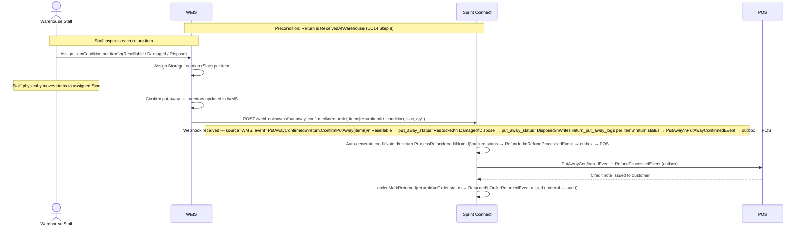
```mermaid
sequenceDiagram
    actor WS as Warehouse Staff
    participant WMS as WMS
    participant SC as Sprint Connect
    participant POS as POS

    Note over WMS,SC: Precondition: Return is ReceivedAtWarehouse (UC14 Step 8)

    Note over WMS,WS: Staff inspects each return item
    WS->>WMS: Assign ItemCondition per item\n(Resellable / Damaged / Dispose)
    WMS->>WMS: Assign StorageLocation (Sloc) per item
    Note over WS: Staff physically moves items to assigned Sloc

    WMS->>WMS: Confirm put-away — inventory updated in WMS
    WMS->>SC: POST /webhooks/wms/put-away-confirmed\n(returnId, items[returnItemId, condition, sloc, qty])
    Note over SC: Webhook received — source=WMS, event=PutAwayConfirmed\nreturn.ConfirmPutAway(items)\n  Resellable → put_away_status=Restocked\n  Damaged/Dispose → put_away_status=Disposed\nWrites return_put_away_logs per item\nreturn.status → PutAway\nPutAwayConfirmedEvent → outbox → POS

    SC->>SC: Auto-generate creditNoteId\nreturn.ProcessRefund(creditNoteId)\nreturn.status → Refunded\nRefundProcessedEvent → outbox → POS

    SC->>POS: PutAwayConfirmedEvent + RefundProcessedEvent (outbox)
    POS-->>SC: Credit note issued to customer

    SC->>SC: order.MarkReturned(returnId)\nOrder status → Returned\nOrderReturnedEvent raised (internal — audit)
```

---

## UC15 — Order On Hold / Release

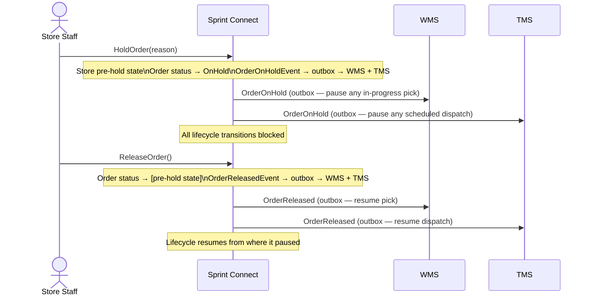
```mermaid
sequenceDiagram
    actor SS as Store Staff
    participant SC as Sprint Connect

    SS->>SC: HoldOrder(reason)
    Note over SC: Store pre-hold state\nOrder status → OnHold\nOrderOnHoldEvent → outbox → WMS + TMS

    SC->>WMS: OrderOnHold (outbox — pause any in-progress pick)
    SC->>TMS: OrderOnHold (outbox — pause any scheduled dispatch)

    Note over SC: All lifecycle transitions blocked

    SS->>SC: ReleaseOrder()
    Note over SC: Order status → [pre-hold state]\nOrderReleasedEvent → outbox → WMS + TMS

    SC->>WMS: OrderReleased (outbox — resume pick)
    SC->>TMS: OrderReleased (outbox — resume dispatch)

    Note over SC: Lifecycle resumes from where it paused
```

---

## UC16 — Package Lost (Exception Handling)

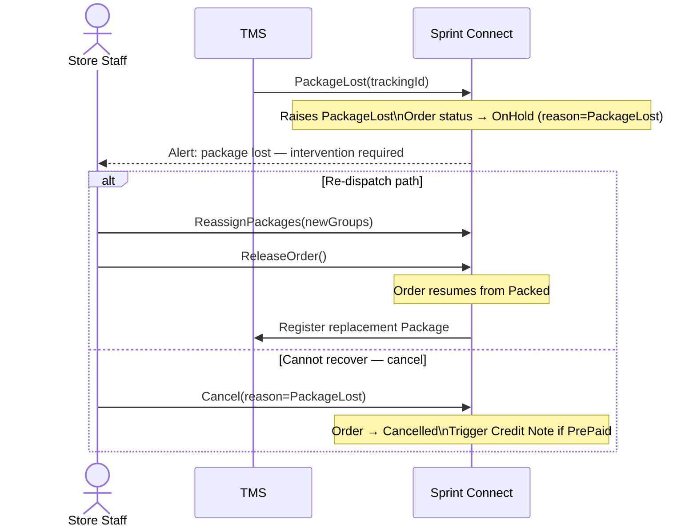
```mermaid
sequenceDiagram
    actor SS as Store Staff
    participant TMS as TMS
    participant SC as Sprint Connect

    TMS->>SC: PackageLost(trackingId)
    Note over SC: Raises PackageLost\nOrder status → OnHold (reason=PackageLost)

    SC-->>SS: Alert: package lost — intervention required

    alt Re-dispatch path
        SS->>SC: ReassignPackages(newGroups)
        SS->>SC: ReleaseOrder()
        Note over SC: Order resumes from Packed
        SC->>TMS: Register replacement Package
    else Cannot recover — cancel
        SS->>SC: Cancel(reason=PackageLost)
        Note over SC: Order → Cancelled\nTrigger Credit Note if PrePaid
    end
```

---

## UC13 — Reassign Packages

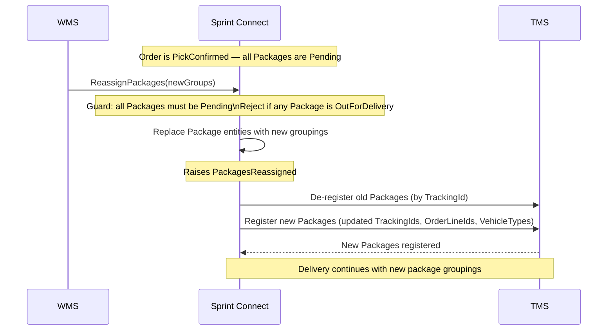
```mermaid
sequenceDiagram
    participant WMS as WMS
    participant SC as Sprint Connect
    participant TMS as TMS

    Note over SC: Order is PickConfirmed — all Packages are Pending
    WMS->>SC: ReassignPackages(newGroups)
    Note over SC: Guard: all Packages must be Pending\nReject if any Package is OutForDelivery

    SC->>SC: Replace Package entities with new groupings
    Note over SC: Raises PackagesReassigned

    SC->>TMS: De-register old Packages (by TrackingId)
    SC->>TMS: Register new Packages (updated TrackingIds, OrderLineIds, VehicleTypes)
    TMS-->>SC: New Packages registered

    Note over SC,TMS: Delivery continues with new package groupings
```

---

## UC20 — Package Damaged During Delivery

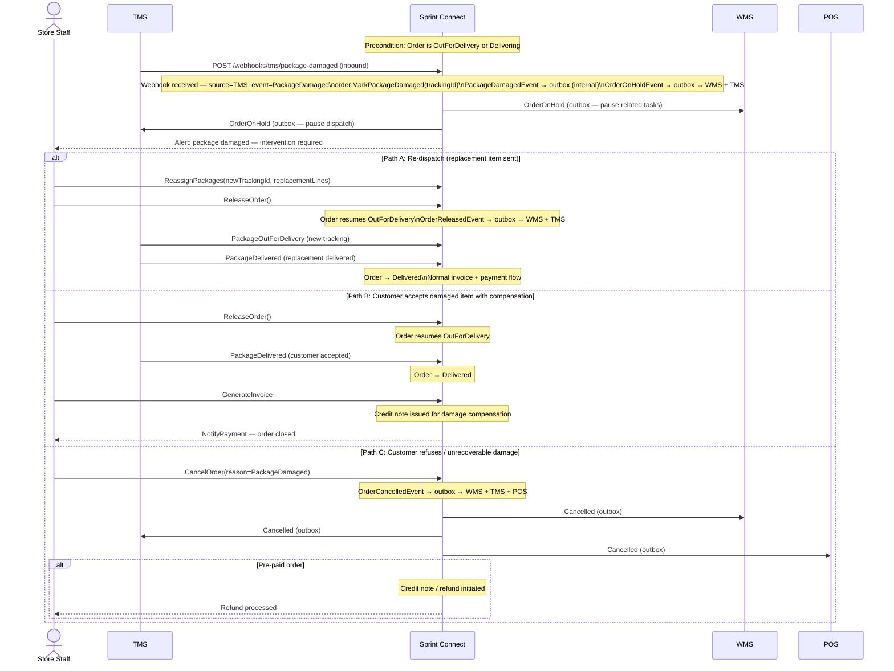
```mermaid
sequenceDiagram
    actor SS as Store Staff
    participant TMS as TMS
    participant SC as Sprint Connect
    participant WMS as WMS

    Note over SC: Precondition: Order is OutForDelivery or Delivering

    TMS->>SC: POST /webhooks/tms/package-damaged (inbound)
    Note over SC: Webhook received — source=TMS, event=PackageDamaged\norder.MarkPackageDamaged(trackingId)\nPackageDamagedEvent → outbox (internal)\nOrderOnHoldEvent → outbox → WMS + TMS
    SC->>WMS: OrderOnHold (outbox — pause related tasks)
    SC->>TMS: OrderOnHold (outbox — pause dispatch)
    SC-->>SS: Alert: package damaged — intervention required

    alt Path A: Re-dispatch (replacement item sent)
        SS->>SC: ReassignPackages(newTrackingId, replacementLines)
        SS->>SC: ReleaseOrder()
        Note over SC: Order resumes OutForDelivery\nOrderReleasedEvent → outbox → WMS + TMS
        TMS->>SC: PackageOutForDelivery (new tracking)
        TMS->>SC: PackageDelivered (replacement delivered)
        Note over SC: Order → Delivered\nNormal invoice + payment flow

    else Path B: Customer accepts damaged item with compensation
        SS->>SC: ReleaseOrder()
        Note over SC: Order resumes OutForDelivery
        TMS->>SC: PackageDelivered (customer accepted)
        Note over SC: Order → Delivered
        SS->>SC: GenerateInvoice
        Note over SC: Credit note issued for damage compensation
        SC-->>SS: NotifyPayment — order closed

    else Path C: Customer refuses / unrecoverable damage
        SS->>SC: CancelOrder(reason=PackageDamaged)
        Note over SC: OrderCancelledEvent → outbox → WMS + TMS + POS
        SC->>WMS: Cancelled (outbox)
        SC->>TMS: Cancelled (outbox)
        SC->>POS: Cancelled (outbox)
        alt Pre-paid order
            Note over SC: Credit note / refund initiated
            SC-->>SS: Refund processed
        end
    end
```

---

## UC19 — Item Substitution During Pick

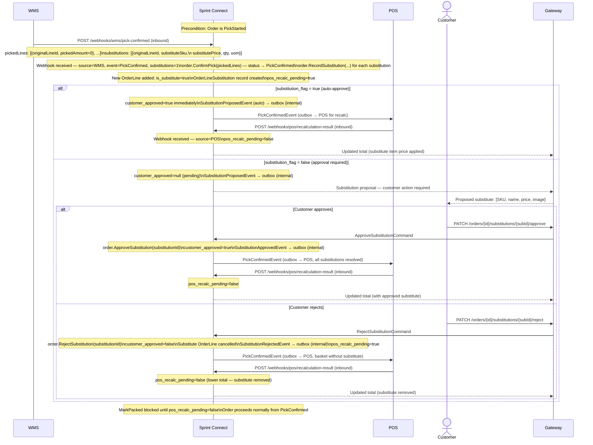
```mermaid
sequenceDiagram
    participant WMS as WMS
    participant SC as Sprint Connect
    participant POS as POS
    actor C as Customer
    participant GW as Gateway

    Note over SC: Precondition: Order is PickStarted

    WMS->>SC: POST /webhooks/wms/pick-confirmed (inbound)
    Note over SC,WMS: pickedLines: [{originalLineId, pickedAmount=0}, ...]\nsubstitutions: [{originalLineId, substituteSku,\n  substitutePrice, qty, uom}]

    Note over SC: Webhook received — source=WMS, event=PickConfirmed, substitutions=1\norder.ConfirmPick(pickedLines) — status → PickConfirmed\norder.RecordSubstitution(...) for each substitution

    Note over SC: New OrderLine added: is_substitute=true\nOrderLineSubstitution record created\npos_recalc_pending=true

    alt substitution_flag = true (auto-approve)
        Note over SC: customer_approved=true immediately\nSubstitutionProposedEvent (auto) → outbox (internal)
        SC->>POS: PickConfirmedEvent (outbox → POS for recalc)
        POS->>SC: POST /webhooks/pos/recalculation-result (inbound)
        Note over SC: Webhook received — source=POS\npos_recalc_pending=false
        SC-->>GW: Updated total (substitute item price applied)

    else substitution_flag = false (approval required)
        Note over SC: customer_approved=null (pending)\nSubstitutionProposedEvent → outbox (internal)
        SC-->>GW: Substitution proposal — customer action required
        GW-->>C: Proposed substitute: [SKU, name, price, image]

        alt Customer approves
            C->>GW: PATCH /orders/{id}/substitutions/{subId}/approve
            GW->>SC: ApproveSubstitutionCommand
            Note over SC: order.ApproveSubstitution(substitutionId)\ncustomer_approved=true\nSubstitutionApprovedEvent → outbox (internal)
            SC->>POS: PickConfirmedEvent (outbox → POS, all substitutions resolved)
            POS->>SC: POST /webhooks/pos/recalculation-result (inbound)
            Note over SC: pos_recalc_pending=false
            SC-->>GW: Updated total (with approved substitute)

        else Customer rejects
            C->>GW: PATCH /orders/{id}/substitutions/{subId}/reject
            GW->>SC: RejectSubstitutionCommand
            Note over SC: order.RejectSubstitution(substitutionId)\ncustomer_approved=false\nSubstitute OrderLine cancelled\nSubstitutionRejectedEvent → outbox (internal)\npos_recalc_pending=true
            SC->>POS: PickConfirmedEvent (outbox → POS, basket without substitute)
            POS->>SC: POST /webhooks/pos/recalculation-result (inbound)
            Note over SC: pos_recalc_pending=false (lower total — substitute removed)
            SC-->>GW: Updated total (substitute removed)
        end
    end

    Note over SC: MarkPacked blocked until pos_recalc_pending=false\nOrder proceeds normally from PickConfirmed
```

---

## UC18 — View Order Timeline

```mermaid
sequenceDiagram
    actor OPS as Ops / Support
    participant SC as Sprint Connect
    participant DB as PostgreSQL (orders schema)

    OPS->>SC: GET /api/v1/orders/{orderId}/timeline
    SC->>DB: SELECT * FROM order_status_history WHERE order_id = ?
    SC->>DB: SELECT * FROM order_webhook_logs WHERE order_id = ?
    SC->>DB: SELECT * FROM order_outbox WHERE order_id = ?

    Note over SC: Merge three streams and sort by timestamp:\n  Domain  — every state transition (from→to, actor, detail)\n  Inbound — every webhook received from WMS/TMS/POS\n  Outbound — every event dispatched to WMS/TMS/POS

    SC-->>OPS: OrderTimelineDto (merged, chronological)
    Note over OPS: Example response:\n  Domain:   Created→Pending (gateway-user)\n  Domain:   Pending→BookingConfirmed (staff)\n  Outbound: BookingConfirmedEvent → WMS (status=Published)\n  Domain:   BookingConfirmed→PickStarted (staff)\n  Outbound: PickStartedEvent → WMS (status=Published)\n  Inbound:  PickConfirmed ← WMS (lines=5)\n  Domain:   PickStarted→PickConfirmed (WMS)\n  Outbound: PickConfirmedEvent → POS (status=Published)\n  Inbound:  RecalculationResult ← POS\n  Domain:   PickConfirmed→Packed (staff)\n  Outbound: OrderPackedEvent → TMS (status=Published)\n  Inbound:  PackageDispatched ← TMS (tracking=TRK001)\n  Domain:   Packed→OutForDelivery (TMS)\n  Inbound:  PackageDelivered ← TMS (tracking=TRK001)\n  Domain:   OutForDelivery→Delivered (TMS)\n  Outbound: DeliveredEvent → POS (status=Published)
```

---

## UC21 — Supplier / Purchase Order Receipt (Inbound)

```mermaid
sequenceDiagram
    actor Staff as Staff / ERP
    participant SC as Sprint Connect
    participant WMS as WMS
    participant DB as PostgreSQL (orders schema)

    Staff->>SC: POST /api/v1/inbound/purchase-orders\n(poNumber, supplierId, storeId, lines)
    SC->>DB: INSERT purchase_orders + purchase_order_lines
    Note over SC: PurchaseOrderCreatedEvent → outbox → WMS\nStatus: Created

    SC->>WMS: PurchaseOrderCreatedEvent (outbox → WMS)
    Note over WMS: WMS registers expected goods for receiving dock

    Note over WMS: Supplier arrives at dock — WMS creates GoodsReceipt
    WMS->>SC: POST /webhooks/wms/goods-receipt-confirmed\n(purchaseOrderId, lines[lineId, receivedQty, condition])
    Note over SC: Webhook received — source=WMS, event=GoodsReceiptConfirmed\nPurchaseOrder.ConfirmGoodsReceipt(lines)\nStatus: PartiallyReceived or FullyReceived

    Note over WMS: Staff inspects goods — WMS assigns Sloc per item
    WMS->>SC: POST /webhooks/wms/purchase-order-put-away-confirmed\n(purchaseOrderId)
    Note over SC: Webhook received — source=WMS, event=PutAwayConfirmed\nPurchaseOrder.ConfirmPutAway()\nStock ledger updated

    alt Partial receipt
        Note over SC: Discrepancy flagged for buyer follow-up\nPO remains open until closed manually
    end
```

---

## UC22 — Inter-store Stock Transfer (Inbound)

```mermaid
sequenceDiagram
    actor Staff as Dest Store Staff
    participant SC as Sprint Connect
    participant WMS_S as WMS (Source)
    participant WMS_D as WMS (Dest)
    participant TMS as TMS
    participant DB as PostgreSQL (orders schema)

    Staff->>SC: POST /api/v1/inbound/transfer-orders\n(transferNumber, sourceStoreId, destStoreId, lines)
    SC->>DB: INSERT transfer_orders + transfer_order_lines
    Note over SC: TransferOrderCreatedEvent → outbox → WMS (source)\nStatus: Created

    SC->>WMS_S: TransferOrderCreatedEvent (outbox)
    Note over WMS_S: Source store picks items for transfer

    WMS_S->>SC: POST /webhooks/wms/transfer-pick-confirmed\n(transferOrderId, lines[lineId, transferredQty])
    Note over SC: Webhook received — source=WMS, event=TransferPickConfirmed\nTransferOrder.ConfirmPick(lines)\nTransferPickConfirmedEvent → outbox → TMS\nStatus: PickConfirmed

    SC->>TMS: TransferPickConfirmedEvent (register shipment)
    TMS-->>SC: TrackingId assigned

    TMS->>SC: POST /webhooks/tms/package-dispatched\n(transferOrderId, trackingId)
    Note over SC: TransferOrder.MarkInTransit(trackingId)\nStatus: InTransit

    TMS->>SC: POST /webhooks/tms/package-delivered\n(transferOrderId, trackingId)
    Note over SC: Package arrives at destination store

    WMS_D->>SC: POST /webhooks/wms/transfer-received\n(transferOrderId)
    Note over SC: Webhook received — source=WMS, event=TransferReceived\nTransferOrder.ConfirmReceived() → Complete()\nTransferOrderCompletedEvent raised\nStatus: Completed\nStock balances updated at both stores
```

---

## UC23 — Damaged Goods Return Receipt (Inbound)

```mermaid
sequenceDiagram
    participant TMS as TMS Driver
    participant WMS as WMS
    participant SC as Sprint Connect
    participant DB as PostgreSQL (orders schema)

    Note over SC: Precondition: UC20 Path A — order OnHold, replacement sent, driver returns damaged package

    TMS->>WMS: Driver returns damaged package to receiving dock
    WMS->>SC: POST /webhooks/wms/damaged-goods-received\n(orderId, trackingId)
    Note over SC: Webhook received — source=WMS, event=DamagedGoodsReceived\nOrder.ConfirmDamagedGoodsReceived(trackingId)\nDamagedGoodsReceivedEvent raised (internal)

    Note over WMS: Staff inspects items — assigns ItemCondition per SKU
    WMS->>SC: POST /webhooks/wms/damaged-goods-put-away-confirmed\n(orderId, trackingId, items[sku, condition, sloc])
    Note over SC: Webhook received — source=WMS, event=DamagedGoodsPutAwayConfirmed\nOrder.ConfirmDamagedGoodsPutAway(trackingId)\nDamagedGoodsPutAwayConfirmedEvent raised

    Note over SC: Resolution by condition:\n  Resellable → stock restored to available inventory\n  Repairable → flagged for repair workflow\n  Dispose   → written off; insurance/cost-of-goods adjustment triggered

    Note over SC: Damaged goods record closed\nLinked to original order for audit trail
```

---

## UC24 — End-to-End: Inbound Receipt to Outbound Delivery

```mermaid
sequenceDiagram
    actor SUP as Supplier
    actor C as Customer
    participant SC as Sprint Connect
    participant WMS as WMS
    participant POS as POS
    participant TMS as TMS
    participant DB as PostgreSQL (orders schema)

    rect rgb(230, 245, 255)
        Note over SUP,WMS: Phase 1 — Inbound: Goods Arrive at Warehouse (UC21)

        SC->>DB: INSERT purchase_orders (status=Created)
        SC->>WMS: PurchaseOrderCreatedEvent (outbox)\nWMS registers expected delivery at dock

        SUP->>WMS: Delivers goods to receiving dock
        WMS->>SC: POST /webhooks/wms/goods-receipt-confirmed\n(purchaseOrderId, lines[lineId, receivedQty, condition])
        Note over SC: Webhook received — source=WMS, event=GoodsReceiptConfirmed\nPurchaseOrder.ConfirmGoodsReceipt(lines)\nPO status → FullyReceived / PartiallyReceived

        Note over WMS: Warehouse staff inspects goods\nWMS assigns Sloc per item
        WMS->>SC: POST /webhooks/wms/purchase-order-put-away-confirmed
        Note over SC: Webhook received — source=WMS, event=PutAwayConfirmed\nPurchaseOrder.ConfirmPutAway()

        Note over WMS: ✓ Stock available — SKUs incremented in WMS inventory\n  Picker can now find goods at assigned Sloc
    end

    rect rgb(240, 255, 240)
        Note over C,TMS: Phase 2 — Outbound: Customer Order Fulfilled (UC1)

        C->>SC: POST /api/v1/orders (includes SKUs from received PO)
        Note over SC: Order created — OrderCreatedEvent → outbox → WMS\nStatus: Pending → BookingConfirmed

        SC->>WMS: BookingConfirmedEvent + PickStartedEvent (outbox)
        Note over WMS: Picker walks to Sloc (same location from put-away)\nPicks goods placed there during inbound phase

        WMS->>SC: POST /webhooks/wms/pick-confirmed (inbound)
        Note over SC: Webhook received — source=WMS, event=PickConfirmed\nPickConfirmedEvent → outbox → POS

        SC->>POS: PickConfirmedEvent
        POS->>SC: POST /webhooks/pos/recalculation-result
        Note over SC: Prices confirmed\nOrder → PickConfirmed

        Note over WMS: Items packed into packages with TrackingIds
        Note over SC: Order.MarkPacked() — OrderPackedEvent → outbox → TMS

        SC->>TMS: OrderPackedEvent (outbox)
        TMS->>SC: POST /webhooks/tms/package-dispatched
        Note over SC: Order → OutForDelivery

        TMS->>SC: POST /webhooks/tms/package-delivered
        Note over SC: Order → Delivered\nDeliveredEvent → outbox → POS (invoice trigger)
        SC-->>C: Notify Paid — order closed
    end

    Note over SC,WMS: OMS orchestrates both phases.\nWMS owns actual stock counts — the bridge between inbound and outbound\nis entirely inside WMS: put-away increments stock;\nPickStarted decrements it.
```
