# OMS User Journey Diagrams

> Sprint Connect owns and runs the OMS. All order management steps attributed to "OMS" are shown as Sprint Connect.

---

## UC1 — Pre-paid Delivery Order

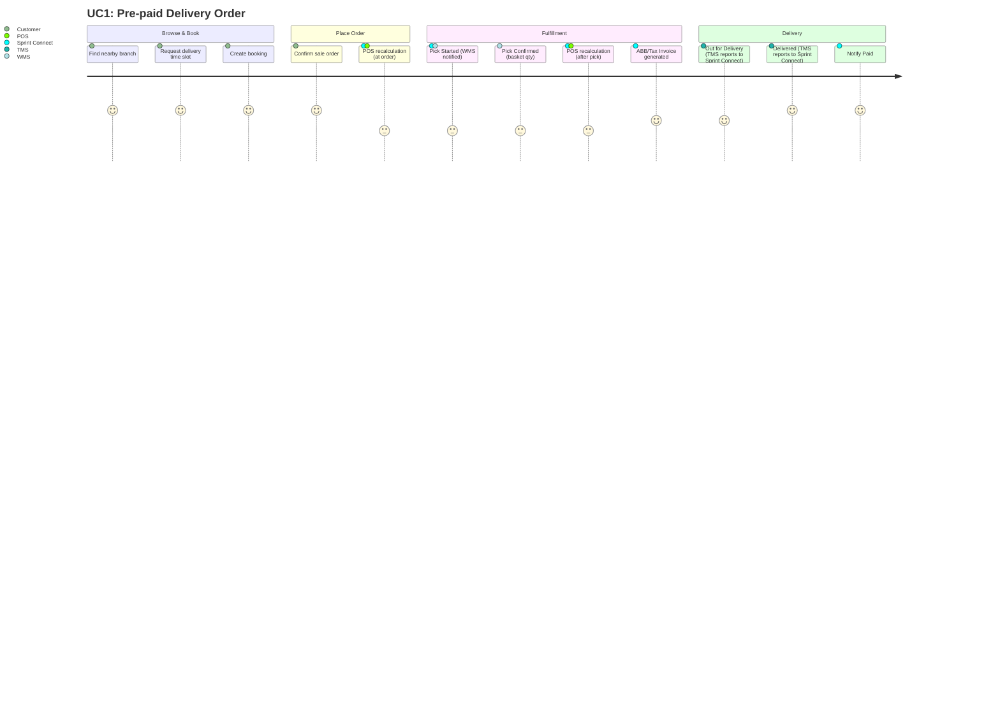
```mermaid
journey
    title UC1: Pre-paid Delivery Order
    section Browse & Book
      Find nearby branch: 5: Customer
      Request delivery time slot: 5: Customer
      Create booking: 5: Customer
    section Place Order
      Confirm sale order: 5: Customer
      POS recalculation (at order): 3: Sprint Connect, POS
    section Fulfillment
      Pick Started (WMS notified): 3: Sprint Connect, WMS
      Pick Confirmed (basket qty): 3: WMS
      POS recalculation (after pick): 3: Sprint Connect, POS
      ABB/Tax Invoice generated: 4: Sprint Connect
    section Delivery
      Out for Delivery (TMS reports to Sprint Connect): 4: TMS
      Delivered (TMS reports to Sprint Connect): 5: TMS
      Notify Paid: 5: Sprint Connect
```

---

## UC2 — Pay-on-Delivery (POD) Order

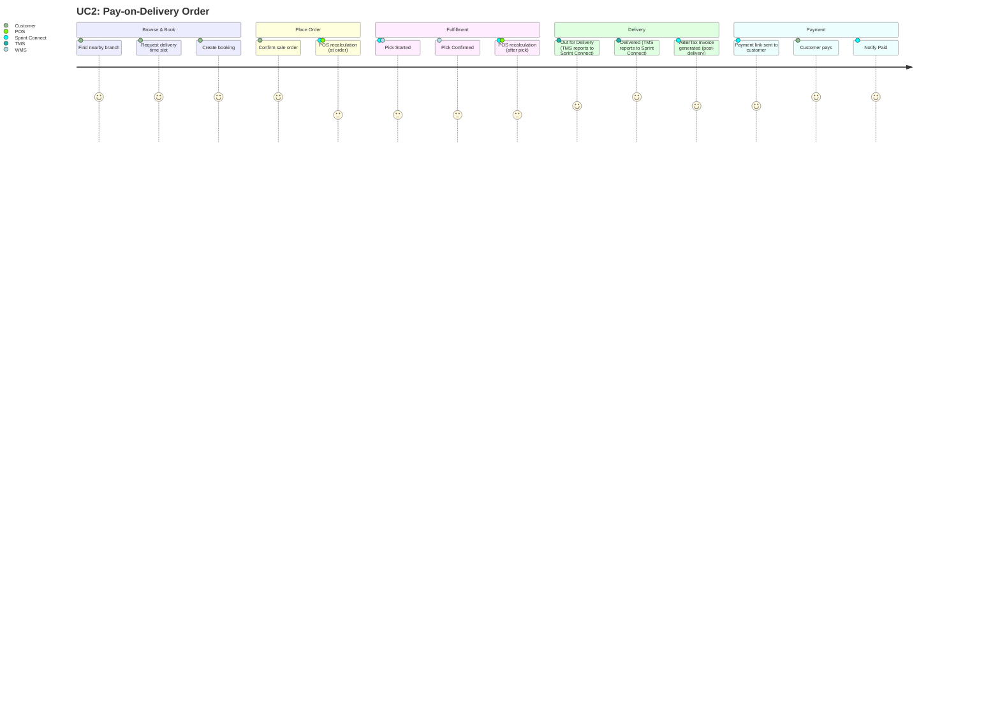
```mermaid
journey
    title UC2: Pay-on-Delivery Order
    section Browse & Book
      Find nearby branch: 5: Customer
      Request delivery time slot: 5: Customer
      Create booking: 5: Customer
    section Place Order
      Confirm sale order: 5: Customer
      POS recalculation (at order): 3: Sprint Connect, POS
    section Fulfillment
      Pick Started: 3: Sprint Connect, WMS
      Pick Confirmed: 3: WMS
      POS recalculation (after pick): 3: Sprint Connect, POS
    section Delivery
      Out for Delivery (TMS reports to Sprint Connect): 4: TMS
      Delivered (TMS reports to Sprint Connect): 5: TMS
      ABB/Tax Invoice generated (post-delivery): 4: Sprint Connect
    section Payment
      Payment link sent to customer: 4: Sprint Connect
      Customer pays: 5: Customer
      Notify Paid: 5: Sprint Connect
```

---

## UC3 — Order Cancellation

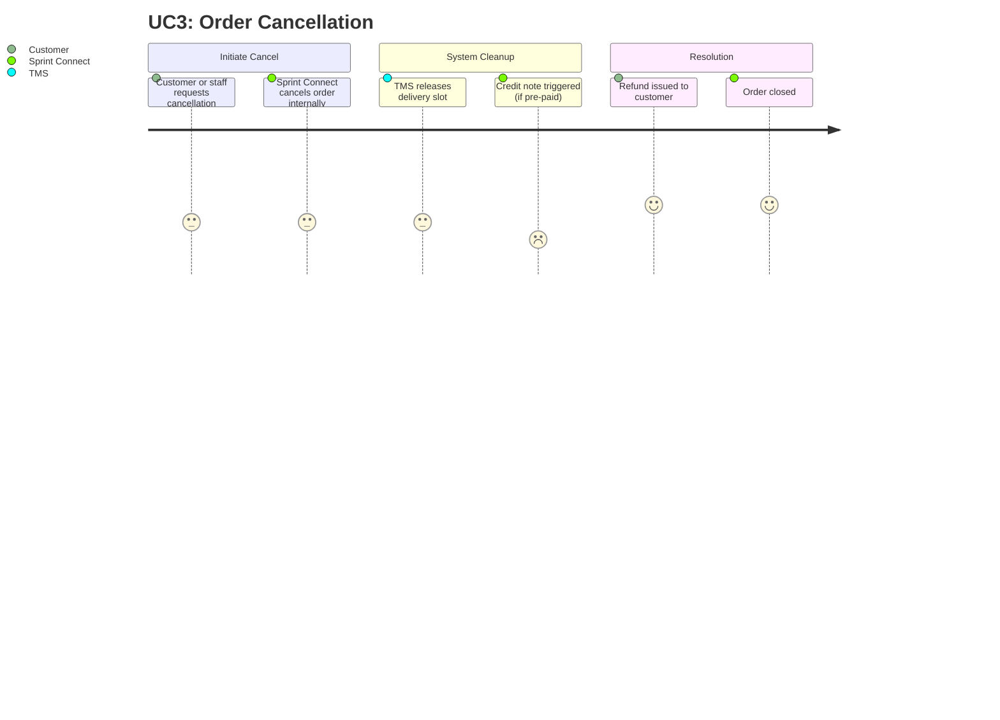
```mermaid
journey
    title UC3: Order Cancellation
    section Initiate Cancel
      Customer or staff requests cancellation: 3: Customer
      Sprint Connect cancels order internally: 3: Sprint Connect
    section System Cleanup
      TMS releases delivery slot: 3: TMS
      Credit note triggered (if pre-paid): 2: Sprint Connect
    section Resolution
      Refund issued to customer: 4: Customer
      Order closed: 4: Sprint Connect
```

---

## UC4 — Delivery Reschedule

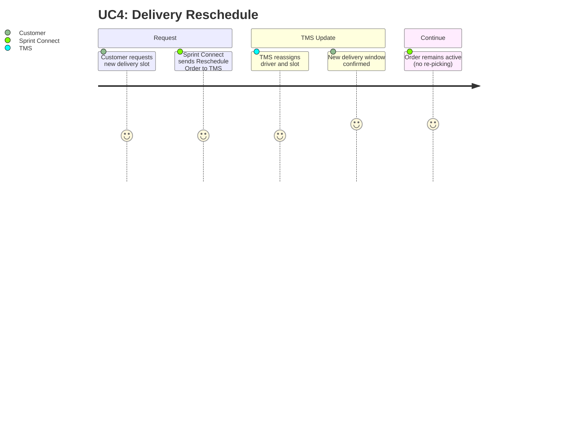
```mermaid
journey
    title UC4: Delivery Reschedule
    section Request
      Customer requests new delivery slot: 4: Customer
      Sprint Connect sends Reschedule Order to TMS: 4: Sprint Connect
    section TMS Update
      TMS reassigns driver and slot: 4: TMS
      New delivery window confirmed: 5: Customer
    section Continue
      Order remains active (no re-picking): 5: Sprint Connect
```

---

## UC5 — Partial Pick & Credit Note

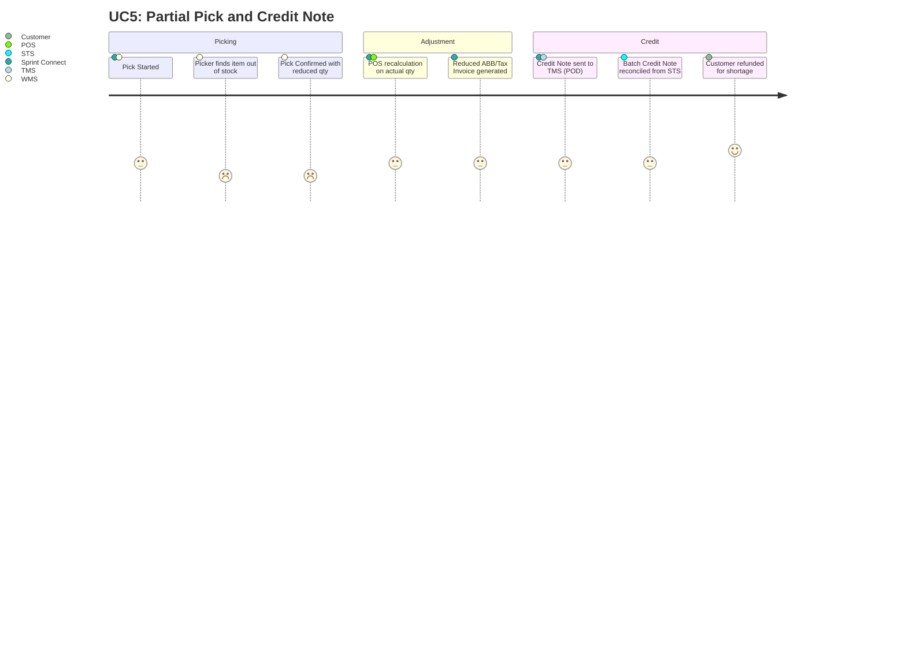
```mermaid
journey
    title UC5: Partial Pick and Credit Note
    section Picking
      Pick Started: 3: Sprint Connect, WMS
      Picker finds item out of stock: 2: WMS
      Pick Confirmed with reduced qty: 2: WMS
    section Adjustment
      POS recalculation on actual qty: 3: Sprint Connect, POS
      Reduced ABB/Tax Invoice generated: 3: Sprint Connect
    section Credit
      Credit Note sent to TMS (POD): 3: Sprint Connect, TMS
      Batch Credit Note reconciled from STS: 3: STS
      Customer refunded for shortage: 4: Customer
```

---

## UC6 — Non-Rolled-Out Store (Legacy Path)

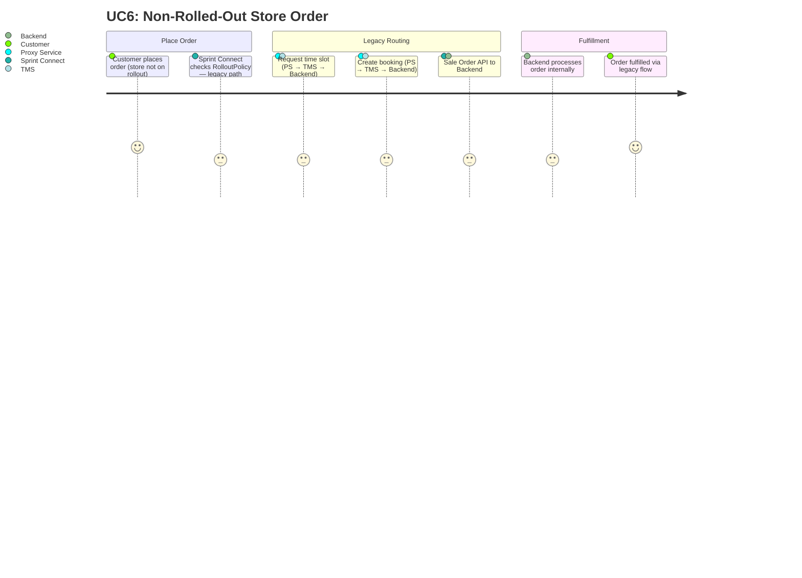
```mermaid
journey
    title UC6: Non-Rolled-Out Store Order
    section Place Order
      Customer places order (store not on rollout): 4: Customer
      Sprint Connect checks RolloutPolicy — legacy path: 3: Sprint Connect
    section Legacy Routing
      Request time slot (PS → TMS → Backend): 3: Proxy Service, TMS
      Create booking (PS → TMS → Backend): 3: Proxy Service, TMS
      Sale Order API to Backend: 3: Sprint Connect, Backend
    section Fulfillment
      Backend processes order internally: 3: Backend
      Order fulfilled via legacy flow: 4: Customer
```

---

## UC7 — Item Master & Product Sync (Background)

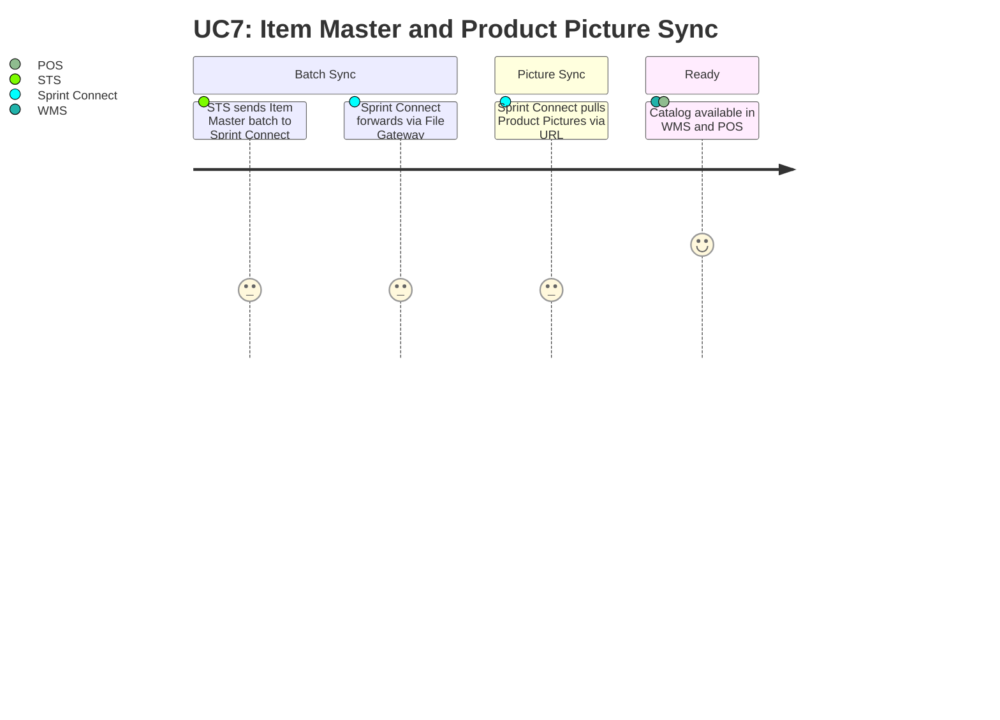
```mermaid
journey
    title UC7: Item Master and Product Picture Sync
    section Batch Sync
      STS sends Item Master batch to Sprint Connect: 3: STS
      Sprint Connect forwards via File Gateway: 3: Sprint Connect
    section Picture Sync
      Sprint Connect pulls Product Pictures via URL: 3: Sprint Connect
    section Ready
      Catalog available in WMS and POS: 5: WMS, POS
```

---

## UC8 — Click & Collect Order

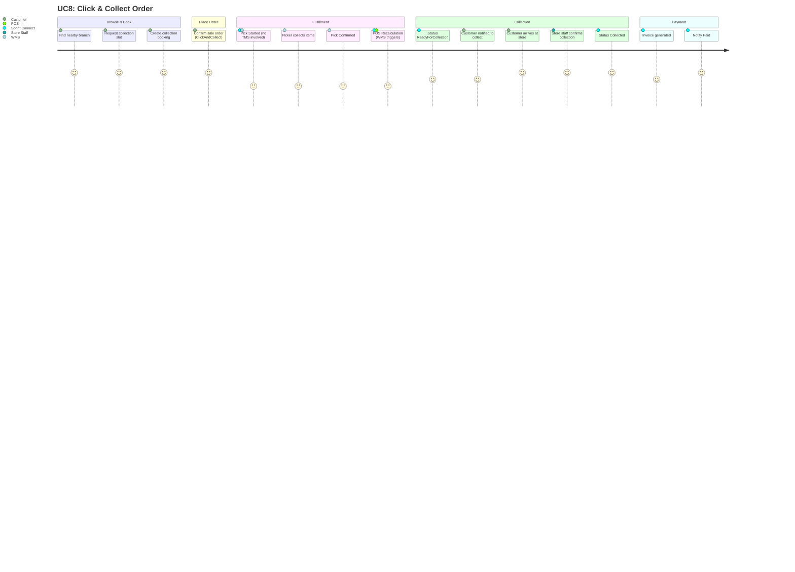
```mermaid
journey
    title UC8: Click & Collect Order
    section Browse & Book
      Find nearby branch: 5: Customer
      Request collection slot: 5: Customer
      Create collection booking: 5: Customer
    section Place Order
      Confirm sale order (ClickAndCollect): 5: Customer
    section Fulfillment
      Pick Started (no TMS involved): 3: Sprint Connect, WMS
      Picker collects items: 3: WMS
      Pick Confirmed: 3: WMS
      POS Recalculation (WMS triggers): 3: Sprint Connect, POS
    section Collection
      Status ReadyForCollection: 4: Sprint Connect
      Customer notified to collect: 4: Customer
      Customer arrives at store: 5: Customer
      Store staff confirms collection: 5: Store Staff
      Status Collected: 5: Sprint Connect
    section Payment
      Invoice generated: 4: Sprint Connect
      Notify Paid: 5: Sprint Connect
```

---

## UC9 — Express Delivery Order

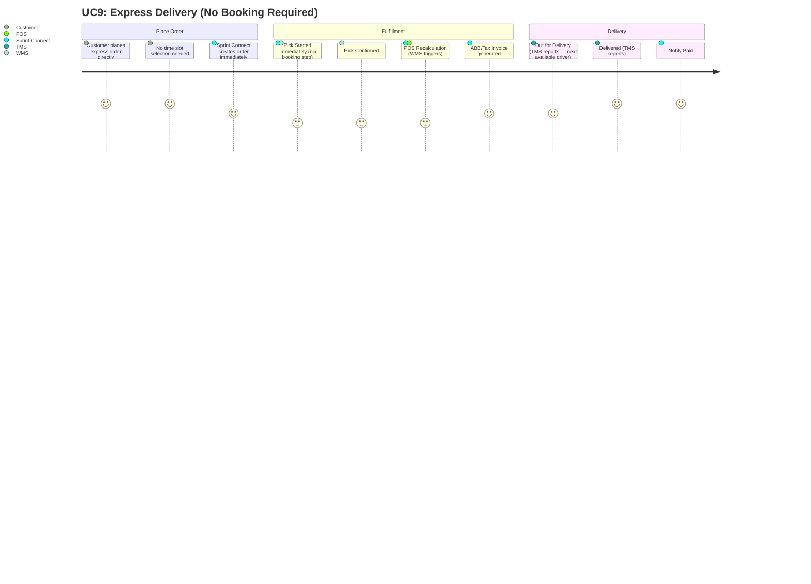
```mermaid
journey
    title UC9: Express Delivery (No Booking Required)
    section Place Order
      Customer places express order directly: 5: Customer
      No time slot selection needed: 5: Customer
      Sprint Connect creates order immediately: 4: Sprint Connect
    section Fulfillment
      Pick Started immediately (no booking step): 3: Sprint Connect, WMS
      Pick Confirmed: 3: WMS
      POS Recalculation (WMS triggers): 3: Sprint Connect, POS
      ABB/Tax Invoice generated: 4: Sprint Connect
    section Delivery
      Out for Delivery (TMS reports — next available driver): 4: TMS
      Delivered (TMS reports): 5: TMS
      Notify Paid: 5: Sprint Connect
```

---

## UC10 — Weight-Based Item Order

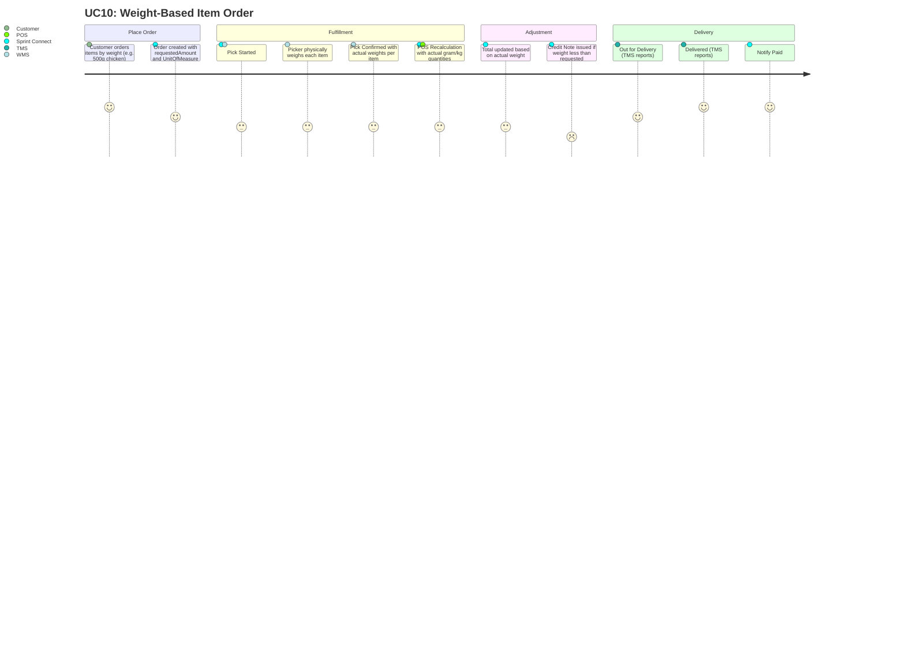
```mermaid
journey
    title UC10: Weight-Based Item Order
    section Place Order
      Customer orders items by weight (e.g. 500g chicken): 5: Customer
      Order created with requestedAmount and UnitOfMeasure: 4: Sprint Connect
    section Fulfillment
      Pick Started: 3: Sprint Connect, WMS
      Picker physically weighs each item: 3: WMS
      Pick Confirmed with actual weights per item: 3: WMS
      POS Recalculation with actual gram/kg quantities: 3: Sprint Connect, POS
    section Adjustment
      Total updated based on actual weight: 3: Sprint Connect
      Credit Note issued if weight less than requested: 2: Sprint Connect
    section Delivery
      Out for Delivery (TMS reports): 4: TMS
      Delivered (TMS reports): 5: TMS
      Notify Paid: 5: Sprint Connect
```

---

## UC11 — Multi-Vehicle Split Delivery

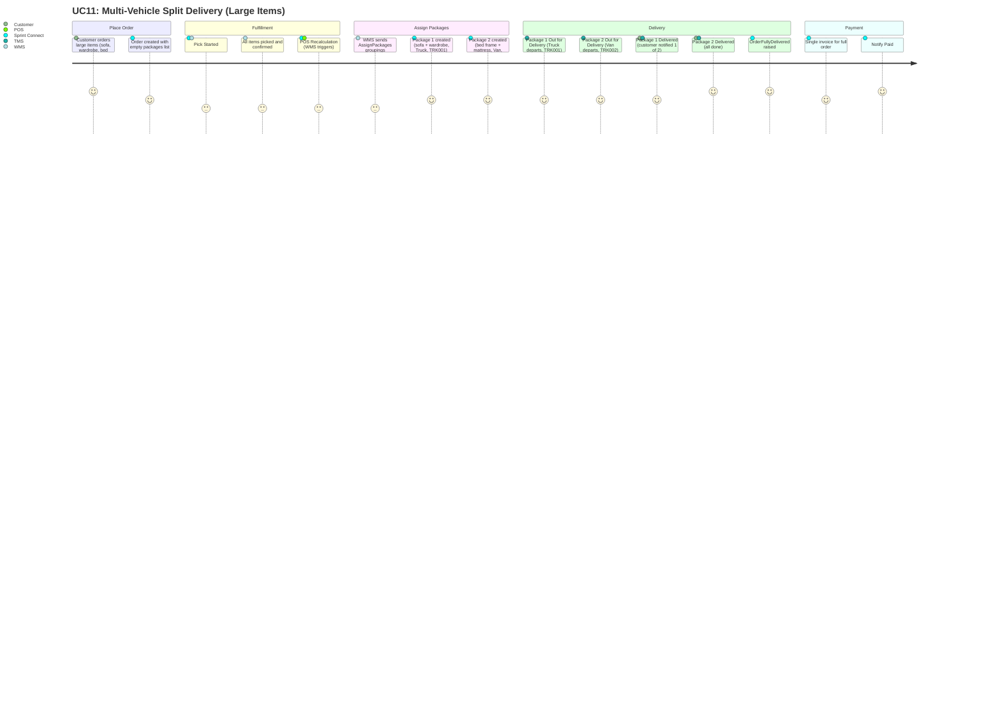
```mermaid
journey
    title UC11: Multi-Vehicle Split Delivery (Large Items)
    section Place Order
      Customer orders large items (sofa, wardrobe, bed frame): 5: Customer
      Order created with empty packages list: 4: Sprint Connect
    section Fulfillment
      Pick Started: 3: Sprint Connect, WMS
      All items picked and confirmed: 3: WMS
      POS Recalculation (WMS triggers): 3: Sprint Connect, POS
    section Assign Packages
      WMS sends AssignPackages groupings: 3: WMS
      Package 1 created (sofa + wardrobe, Truck, TRK001): 4: Sprint Connect
      Package 2 created (bed frame + mattress, Van, TRK002): 4: Sprint Connect
    section Delivery
      Package 1 Out for Delivery (Truck departs, TRK001): 4: TMS
      Package 2 Out for Delivery (Van departs, TRK002): 4: TMS
      Package 1 Delivered (customer notified 1 of 2): 4: Customer, TMS
      Package 2 Delivered (all done): 5: Customer, TMS
      OrderFullyDelivered raised: 5: Sprint Connect
    section Payment
      Single invoice for full order: 4: Sprint Connect
      Notify Paid: 5: Sprint Connect
```

---

## UC12 — Modify Order Lines After Placement

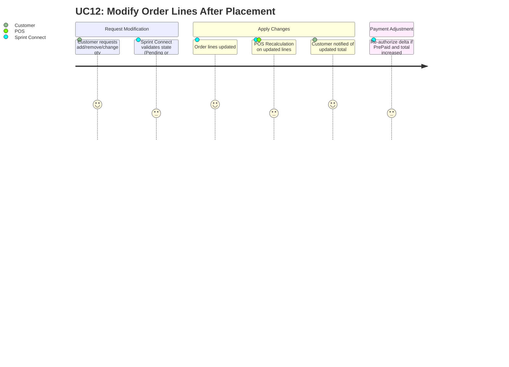
```mermaid
journey
    title UC12: Modify Order Lines After Placement
    section Request Modification
      Customer requests add/remove/change qty: 4: Customer
      Sprint Connect validates state (Pending or BookingConfirmed): 3: Sprint Connect
    section Apply Changes
      Order lines updated: 4: Sprint Connect
      POS Recalculation on updated lines: 3: Sprint Connect, POS
      Customer notified of updated total: 4: Customer
    section Payment Adjustment
      Re-authorize delta if PrePaid and total increased: 3: Sprint Connect
```

---

## UC17 — Put Away (Returned Items)

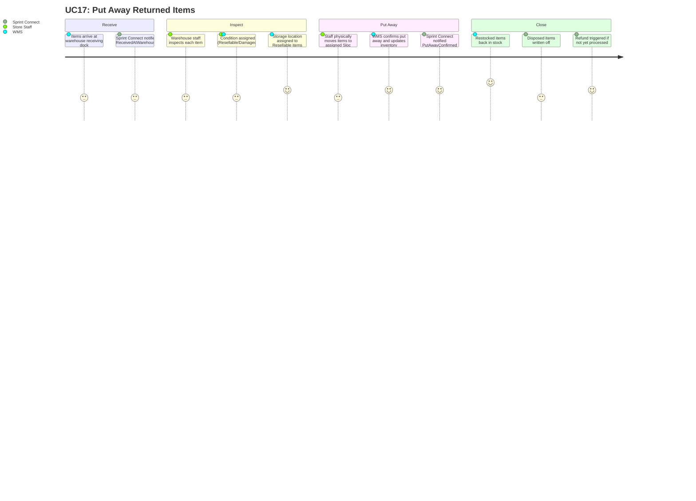
```mermaid
journey
    title UC17: Put Away Returned Items
    section Receive
      Items arrive at warehouse receiving dock: 3: WMS
      Sprint Connect notified ReceivedAtWarehouse: 3: Sprint Connect
    section Inspect
      Warehouse staff inspects each item: 3: Store Staff
      Condition assigned per item (Resellable/Damaged/Dispose): 3: Store Staff, WMS
      Storage location assigned to Resellable items: 4: WMS
    section Put Away
      Staff physically moves items to assigned Sloc: 3: Store Staff
      WMS confirms put away and updates inventory: 4: WMS
      Sprint Connect notified PutAwayConfirmed: 4: Sprint Connect
    section Close
      Restocked items back in stock: 5: WMS
      Disposed items written off: 3: Sprint Connect
      Refund triggered if not yet processed: 4: Sprint Connect
```

---

## UC14 — Return & Refund

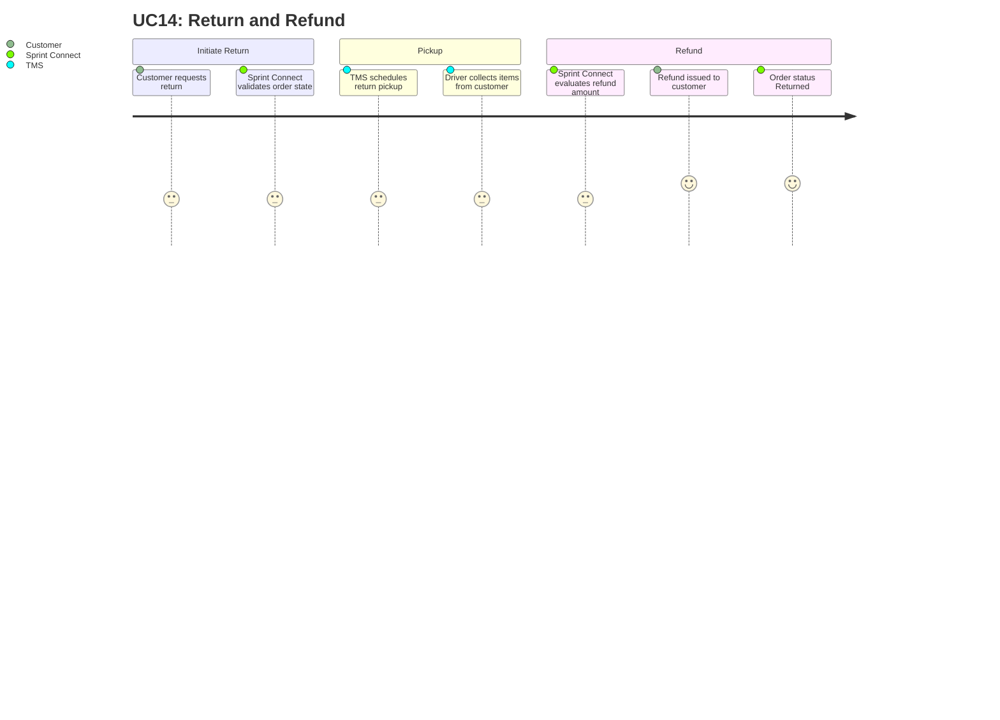
```mermaid
journey
    title UC14: Return and Refund
    section Initiate Return
      Customer requests return: 3: Customer
      Sprint Connect validates order state: 3: Sprint Connect
    section Pickup
      TMS schedules return pickup: 3: TMS
      Driver collects items from customer: 3: TMS
    section Refund
      Sprint Connect evaluates refund amount: 3: Sprint Connect
      Refund issued to customer: 4: Customer
      Order status Returned: 4: Sprint Connect
```

---

## UC15 — Order On Hold / Release

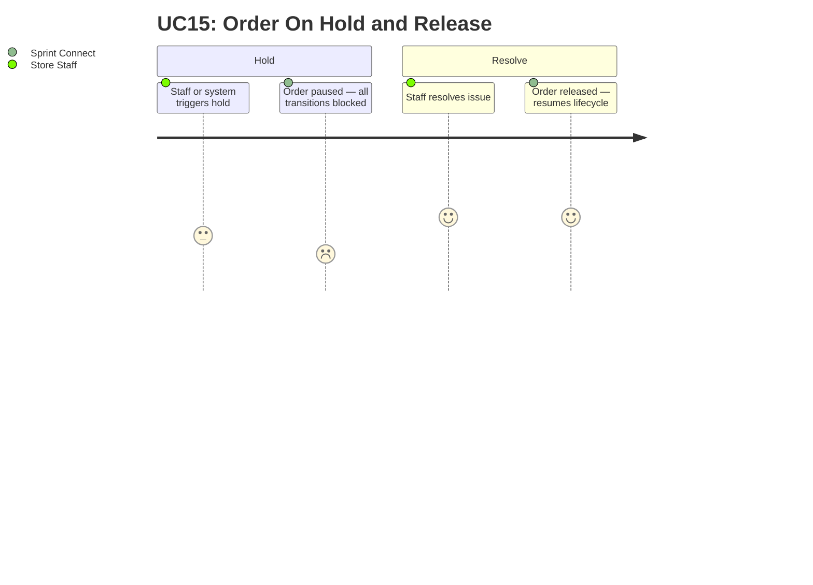
```mermaid
journey
    title UC15: Order On Hold and Release
    section Hold
      Staff or system triggers hold: 3: Store Staff
      Order paused — all transitions blocked: 2: Sprint Connect
    section Resolve
      Staff resolves issue: 4: Store Staff
      Order released — resumes lifecycle: 4: Sprint Connect
```

---

## UC16 — Package Lost

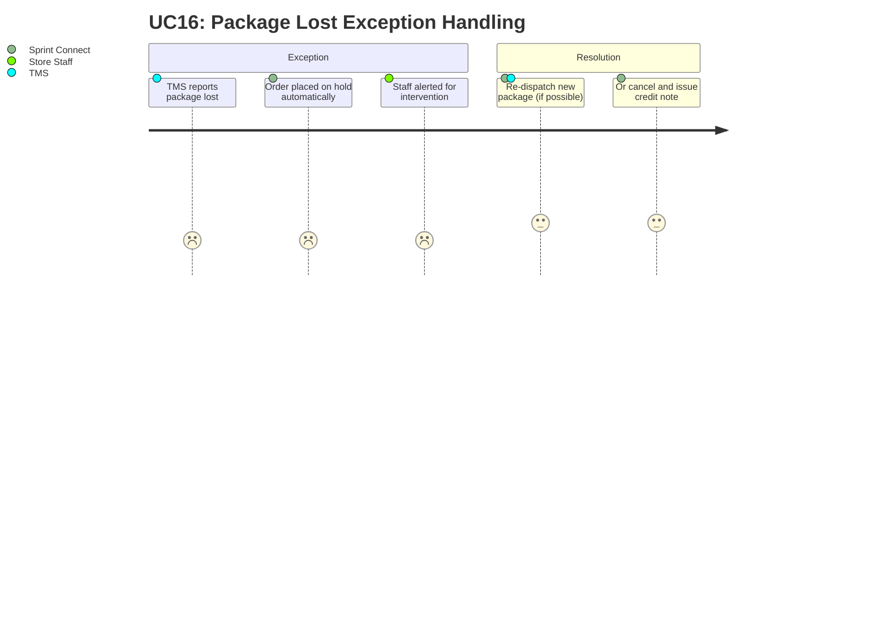
```mermaid
journey
    title UC16: Package Lost Exception Handling
    section Exception
      TMS reports package lost: 2: TMS
      Order placed on hold automatically: 2: Sprint Connect
      Staff alerted for intervention: 2: Store Staff
    section Resolution
      Re-dispatch new package (if possible): 3: Sprint Connect, TMS
      Or cancel and issue credit note: 3: Sprint Connect
```

---

## UC13 — Reassign Packages

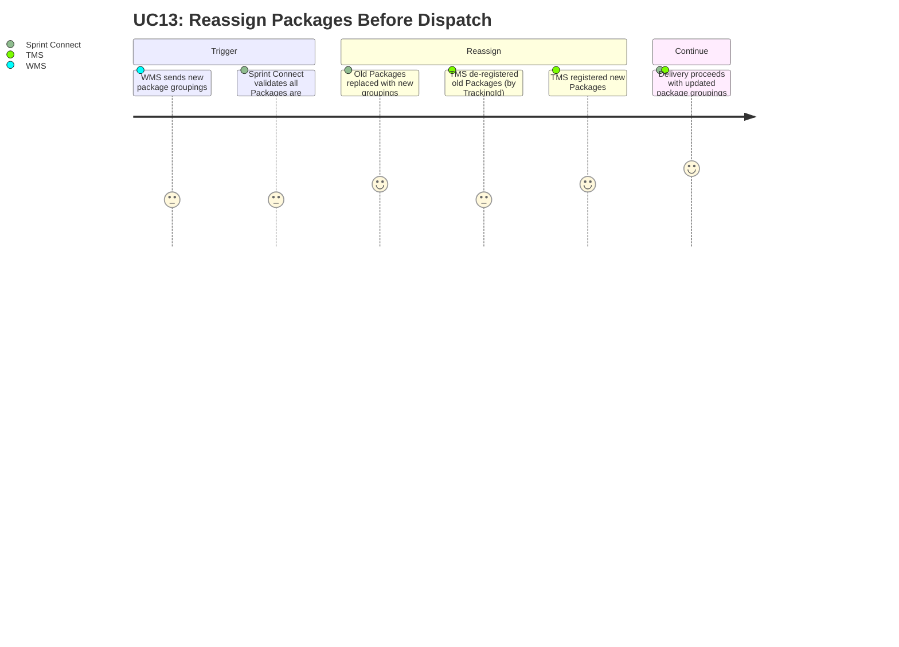
```mermaid
journey
    title UC13: Reassign Packages Before Dispatch
    section Trigger
      WMS sends new package groupings: 3: WMS
      Sprint Connect validates all Packages are Pending: 3: Sprint Connect
    section Reassign
      Old Packages replaced with new groupings: 4: Sprint Connect
      TMS de-registered old Packages (by TrackingId): 3: TMS
      TMS registered new Packages: 4: TMS
    section Continue
      Delivery proceeds with updated package groupings: 5: Sprint Connect, TMS
```
